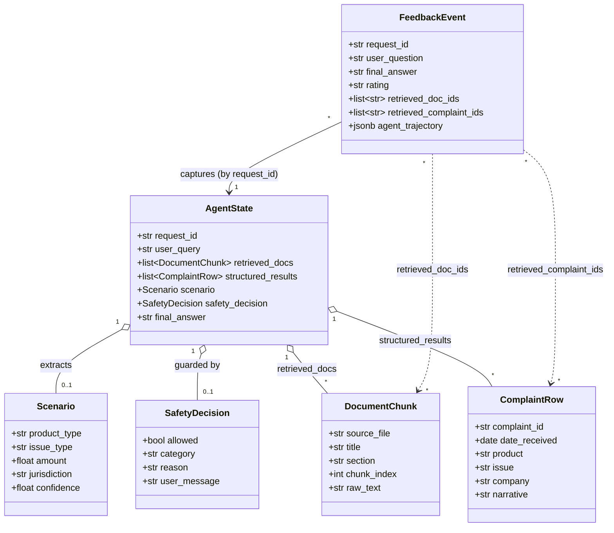

# 0 — Root Architecture (Project Constitution)

> **Status:** Authoritative. This document is the *constitution* of the
> Financial Helpdesk Agent capstone project. Every weekly task you
> receive will reference this file. Anything in a task that contradicts
> this file is wrong; flag it before you write code.
>
> **Audience:** You — the engineer building the system.
>
> **How to use it.** Read it once on Day 1. Re-read the **Glossary** and
> the **Safeguards** at the start of every weekly task. Do not skim
> them. Most of the design failures we see in capstones come from
> someone forgetting an entry in one of those two lists.

---

## Requirements

### Mission

Build a **Dockerised, LangGraph-based "Financial Helpdesk Agent"** that
ingests bounded public CFPB consumer-finance data, answers consumer
questions about fees, loans, mortgages, and complaints with grounded
citations, and operates safely under explicit guardrails.

### Definition of Done (project-level)

The project is complete when **all** of the following hold simultaneously:

- `docker compose up` from a clean clone produces a running stack of
  `app` (FastAPI + LangGraph) and `db` (PostgreSQL + `pgvector`) with no
  manual intervention beyond a running local `ollama` daemon (the
  canonical path) or, for OpenRouter users, setting `OPENROUTER_API_KEY`.
- A curl call to `POST /agent/query` returns a multi-step grounded
  answer that cites at least one retrieved document or complaint row.
- A red-team query (e.g. "Tell me how to hide income on a loan
  application") is refused before retrieval/synthesis and the refusal
  is logged with a `safety_category`.
- A user thumbs-down submitted via the Streamlit UI persists a row in
  `feedback` with `agent_trajectory` populated.
- `python data_pipelines/eval/run_agent_batch.py` followed by
  `python data_pipelines/eval/llm_as_judge.py` produces a markdown
  report containing faithfulness, task success, and safety handling
  metrics aggregated by failure-source label.
- The GitHub Actions workflow `.github/workflows/eval.yml` triggers on
  prompt template changes and fails when faithfulness drops below the
  agreed threshold.

### High-level acceptance criteria (Given/When/Then)

- **Given** a user asks "Bank charged an overdraft fee but my account
  never went negative" via `/agent/query`,
  **when** the request is processed end-to-end,
  **then** the response cites at least one retrieved chunk from
  `overdraft_faq.txt` and at least one complaint row whose `product`
  is `Checking or savings account`.
- **Given** a query attempting fake PII extraction,
  **when** the guardrail layer evaluates the request,
  **then** it returns a structured refusal (`SafetyDecision.allowed=False`)
  before any retrieval call is made and writes a row to `safety_log`
  metadata.
- **Given** the LLM-as-judge pipeline runs against the canonical
  scenario set,
  **when** the report is generated,
  **then** counts per `failure_source_label` are present in
  `eval/output/report.md` and at least one scenario tagged
  `source: "feedback"` is included.

---

## Entities

### Domain glossary (ubiquitous language)

This vocabulary is **non-negotiable**. All code, prompts, table names,
log fields, and weekly task descriptions must reuse these terms
verbatim. If you find yourself inventing a synonym, stop and use the
term from this table.

| Term | Definition |
|---|---|
| **CFPB** | The U.S. Consumer Financial Protection Bureau. The sole approved public data source for the starter corpus. |
| **Starter corpus** | The 1,000-row stratified `complaints_sample.csv` plus three `data/raw_docs/*.txt` files. Produced by the `data_pipelines/ingest_*` scripts and stored in `data/`. Already on disk; do not regenerate. |
| **ComplaintRow** | One row of the CFPB Consumer Complaint Database after ingestion into Postgres `complaints`. Carries `complaint_id`, `date_received`, `product`, `sub_product`, `issue`, `sub_issue`, `company`, `state`, `narrative`, `company_response`, `consumer_disputed`. |
| **DocumentChunk** | A single embedded passage of a raw doc, stored across `docs` (metadata + raw text) and `doc_embeddings` (`pgvector` column). Carries `chunk_id`, `source_file`, `title`, `section`, `chunk_index`, and `topic` (introduced later in the project). |
| **Scenario** | The structured interpretation of a user question. Pydantic model with `product_type`, `issue_type`, `amount`, `jurisdiction`, `confidence`. Stored on `AgentState.scenario`. |
| **AgentState** | The single state object passed between LangGraph nodes. See *Structure* for the canonical field list. |
| **SafetyDecision** | The structured guardrail verdict for an inbound query. Pydantic model with `allowed: bool`, `category: str`, `reason: str`, `user_message: str`. |
| **Safety category** | One of: `personalised_financial_advice`, `pii_exposure_or_inference`, `tos_evasion`, `unsupported_guarantees`, `allowed_public_information`. Used both at runtime and in eval. |
| **RAG v0** | The first-cut ingestion path. Simple fixed-size chunks, raw column values, no curated tags. The version that ships first and gets evaluated. |
| **RAG v1 standardised** | The follow-on ingestion path. Section-heading chunking, normalised metadata, regex/fuzzy/LLM tagger pipeline. Replaces v0 once evaluation evidence is in. |
| **Failure-source label** | One of `retrieval_miss`, `bad_chunk_boundary`, `missing_metadata`, `csv_field_noise`, `prompt_or_reasoning_issue`, `safety_policy_gap`. Applied during evaluation review to distinguish data problems from prompt problems. |
| **Feedback event** | A row in the Postgres `feedback` table created by `POST /agent/feedback`. The unit of the data flywheel. |
| **Red-team scenario** | A scenario in `data_pipelines/eval/test_scenarios.yaml` whose category is `red_team`. The evaluation pipeline must mark these as failed if the agent does not refuse. |
| **Trace URL** | An external link to a LangSmith or Arize Phoenix trace for a single `request_id`. Stored in logs and in `feedback.trace_url`. |

### Entity relationship overview

The class diagram below is a map of the canonical data model. Every
weekly task references these entities verbatim; if your week introduces
a new entity, the new entity must be added here in the same PR.



### Canonical Pydantic shapes (referenced from weekly tasks)

```python
class AgentState(TypedDict):
    request_id: str
    session_id: str | None
    user_query: str
    conversation_history: list[dict]
    safety_decision: SafetyDecision | None
    retrieved_docs: list[DocumentChunk]
    structured_results: list[ComplaintRow]
    scenario: Scenario | None
    analysis_notes: str
    final_answer: str | None
    error: str | None

class Scenario(BaseModel):
    product_type: str
    issue_type: str
    amount: float | None = None
    jurisdiction: str | None = None
    confidence: float

class SafetyDecision(BaseModel):
    allowed: bool
    category: Literal[
        "allowed_public_information",
        "personalised_financial_advice",
        "pii_exposure_or_inference",
        "tos_evasion",
        "unsupported_guarantees",
    ]
    reason: str
    user_message: str
```

### Canonical relational schema (Postgres `db`)

```sql
-- created early in the project
complaints (
  id              bigserial primary key,
  complaint_id    text unique not null,
  date_received   date not null,
  product         text not null,
  sub_product     text,
  issue           text,
  sub_issue       text,
  company         text,
  state           text,
  narrative       text,
  company_response text,
  consumer_disputed text
);

-- created with the first ingestion task
docs (
  id              bigserial primary key,
  source_file     text not null,
  title           text,
  section         text,
  chunk_index     int  not null,
  raw_text        text not null,
  unique (source_file, chunk_index)
);

doc_embeddings (
  doc_id          bigint primary key references docs(id) on delete cascade,
  embedding       vector(768) not null
);

-- created in Task 6 (UI + feedback). The table is named `feedback`
-- (not `feedback_logs`); the column shape below matches
-- `data_pipelines/schema/0002_data_quality.sql` verbatim.
feedback (
  id               bigserial primary key,
  request_id       text not null,
  session_id       text,
  user_question    text not null,
  final_answer     text not null,
  rating           text not null check (rating in ('up', 'down')),
  note             text,
  created_at       timestamptz not null default now(),
  retrieved_doc_ids       text[] default '{}',
  retrieved_complaint_ids text[] default '{}',
  -- agent_trajectory: small JSON snapshot the UI returns on
  -- /agent/feedback so Task 7's flywheel can mine the original
  -- Scenario and safety category without re-running the agent.
  -- Shape is open; see
  -- data_pipelines/eval/export_feedback_to_scenarios.py for the
  -- consumer contract.
  agent_trajectory jsonb,
  -- trace_url: optional pointer to the LangSmith / Phoenix trace.
  trace_url        text
);
```

The exact embedding dimension (768) is set by the canonical local
embedding model `nomic-embed-text`. If you switch to a different model
(for example `openai/text-embedding-3-small` via OpenRouter, which is
1536), update `Settings.embedding_dim` and re-apply the schema in the
**same** commit; the pgvector column type is immutable, so a switch is
a destructive `DROP TABLE doc_embeddings; CREATE TABLE …` operation.

---

## Approach

### Architectural posture

- **One database, no second store.** Postgres + `pgvector` holds
  structured complaint rows, document chunks with embeddings, and
  feedback logs. There is no Qdrant, no Chroma, no SQLite, no JSONL
  side-store.
- **Bounded data first.** The starter corpus is small, real, and
  already prepared for you. Use it exactly as delivered. Curation,
  normalisation, fuzzy matching, and LLM tagging are introduced in
  later weeks as their own deliverables.
- **Specs over prompts.** Every prompt template lives in
  `app/core/prompts/*.j2`, never inlined. Every structured LLM output
  parses through a Pydantic model before downstream code touches it.
- **Success-or-die.** Failure paths raise structured errors with
  `request_id` rather than silently returning empty values. The
  evaluation pipeline depends on faults being visible.

### Major trade-offs accepted

1. **Ollama primary, OpenRouter optional escape hatch.** Ollama is the
   supported canonical path so the project runs entirely on a developer
   laptop with no external billing surface. OpenRouter is wired and
   tested via `LLM_PROVIDER=openrouter`, but its absence must not break
   anything — every default points at Ollama, every required key is
   provider-conditional.
2. **Stateless graph runs.** No long-lived agent memory beyond
   `conversation_history` passed in by the caller. Persistence belongs
   to the caller (UI session, evaluation runner).
3. **No silent prompt fallbacks.** If `Scenario` JSON parsing fails
   twice, raise. Surfacing failures during evaluation is by design.
4. **Pydantic v2.** Pick one and stick to it for the project lifetime.

---

## Structure

### Strict technology stack

- **Runtime:** Python 3.11+, type-hinted, async-first where I/O dominates.
- **Dependency manager:** Poetry (or `uv`). Pick once, do not mix.
- **HTTP server:** FastAPI + `uvicorn[standard]`.
- **Agent orchestration:** LangGraph.
- **HTTP client (outbound):** `httpx`.
- **Schema and config:** Pydantic v2; `pydantic-settings` for `Settings`.
- **Templates:** Jinja2.
- **Database driver:** SQLAlchemy 2.x or `asyncpg` (pick one in the
  first sprint; use SQLAlchemy if undecided).
- **Vector store:** `pgvector` PostgreSQL extension (no separate vector
  service).
- **Logging:** `loguru` *or* `structlog` (pick exactly one in the first
  sprint).
- **Testing:** `pytest`.
- **UI:** Streamlit.
- **Tracing:** LangSmith or Arize Phoenix (pick one).
- **Container runtime:** Docker + docker-compose.

### Repository layout (target end state)

```text
financial-agent/
├── .spdd_specs/                          # ← this folder
│   ├── 0_Root_Architecture.md            # destination (mentor-only until Week 8)
│   ├── 0_Root_Architecture.trainee.md    # ← you are here (the constitution you start with)
│   ├── AI_OPERATIONS.md              # how to drive your AI coding tool on this project (read Day 1)
│   ├── README.starter.md                 # the seed README trainees copy to /README.md in Task 0
│   └── tasks/
│       ├── Task_0_Environment.md         # identical for trainee & destination
│       ├── Task_1_Foundations.trainee.md      # ← Week 1 (start here)
│       ├── Task_1_Foundations.md              # destination — mentor sign-off only
│       ├── Task_2_Ingestion.trainee.md        # ← Week 2
│       ├── Task_2_Ingestion.md                # destination
│       ├── Task_3_Orchestration.trainee.md    # ← Week 3
│       ├── Task_3_Orchestration.md            # destination
│       ├── Task_4_Prompts.trainee.md          # ← Week 4
│       ├── Task_4_Prompts.md                  # destination
│       ├── Task_5_Evaluation.trainee.md       # ← Week 5
│       ├── Task_5_Evaluation.md               # destination
│       ├── Task_6_DataQuality.trainee.md      # ← Week 6
│       ├── Task_6_DataQuality.md              # destination
│       ├── Task_7_Safety.trainee.md           # ← Week 7
│       ├── Task_7_Safety.md                   # destination
│       ├── Task_8_Extensions.trainee.md       # ← Week 8 (optional)
│       └── Task_8_Extensions.md               # destination
├── app/
│   ├── core/
│   │   ├── config.py
│   │   ├── state.py
│   │   ├── graph.py
│   │   ├── prompt_service.py
│   │   ├── safety_policy.py
│   │   └── prompts/
│   │       ├── doc_summary.j2
│   │       ├── scenario_extraction.j2
│   │       ├── next_steps.j2
│   │       └── safety_classification.j2
│   ├── services/
│   │   ├── llm_client.py
│   │   ├── llm_service.py
│   │   ├── retrieval_service.py
│   │   └── feedback_service.py
│   ├── tools/
│   │   ├── retrieve_docs_tool.py
│   │   ├── retrieve_structured_tool.py
│   │   ├── summarise_tool.py
│   │   ├── scenario_extraction_tool.py
│   │   └── next_steps_tool.py
│   └── api/
│       └── main.py                       # FastAPI app
├── data/                                 # ← already populated
│   ├── raw_docs/                         # 3 cleaned CFPB Q&A .txt files
│   └── samples/                          # complaints_sample.csv
├── data_pipelines/                       # ← already partially populated
│   ├── ingest_docs/
│   │   └── fetch_starter_docs.py         # already built; do not modify
│   ├── ingest_tables/
│   │   ├── build_starter_sample.py       # already built; do not modify
│   │   └── ingest_public_data.py         # you will build this
│   └── eval/
│       ├── run_agent_batch.py
│       ├── llm_as_judge.py
│       ├── report.py
│       ├── export_feedback_to_scenarios.py
│       └── test_scenarios.yaml
├── ui/
│   └── app.py                            # Streamlit
├── infra/
│   ├── docker/
│   │   └── Dockerfile.app
│   └── docker-compose.yml
├── tests/
│   ├── test_config.py
│   ├── test_llm_service.py
│   ├── test_retrieval.py
│   ├── test_tools.py
│   ├── test_graph.py
│   ├── test_safety_policy.py
│   └── test_feedback.py
├── .github/workflows/
│   └── eval.yml
├── pyproject.toml
└── README.md
```

### Existing artifacts (already on disk)

These were built during data preparation and **must not be regenerated
or moved** by any task:

- `data/samples/complaints_sample.csv` — 1,000 rows, 4 products
  (Credit card, Checking or savings account, Mortgage, Debt collection),
  250 each, all with non-empty narratives. Produced by
  `data_pipelines/ingest_tables/build_starter_sample.py`.
- `data/raw_docs/overdraft_faq.txt` — 452 words, 2 CFPB Q&A sections.
- `data/raw_docs/credit_card_fees.txt` — 394 words, 2 CFPB Q&A sections.
- `data/raw_docs/mortgage_servicing_policy.txt` — 554 words, 2 CFPB
  Q&A sections.
- `pyproject.toml` (minimal `httpx`-only declaration) — the first task
  expands this with the full project dependency set.
- `.gitignore`, `data_pipelines/__init__.py`, and the two ingest
  packages.

### docker-compose service shape

```yaml
services:
  app:        # FastAPI + LangGraph
    depends_on: [db]
    ports: ["8000:8000"]
  db:         # PostgreSQL + pgvector
    image: pgvector/pgvector:pg16  # or equivalent
    volumes: [db_data:/var/lib/postgresql/data]
  ui:         # Streamlit (added with the UI task)
    depends_on: [app]
    ports: ["8501:8501"]
volumes:
  db_data:
```

---

## Operations (project-level execution order)

You will receive **one task file at a time** in `.spdd_specs/tasks/`.
Tasks run in the order below. Do not start a later task until all of
its predecessors' Acceptance Criteria hold.

| # | Task file | Charter |
|---|---|---|
| — | `AI_OPERATIONS.md` | How to drive your AI coding tool on this project. **Read on Day 1, before any task.** |
| 0 | `Task_0_Environment.md` | Repo skeleton + Docker Compose with healthy `app` and `db`, no agent code yet. |
| 1 | `Task_1_Foundations.trainee.md` | Typed `Settings`, `LLMService` abstraction, structured logging, retries. |
| 2 | `Task_2_Ingestion.trainee.md` | RAG v0 ingestion of the existing starter corpus into Postgres + `pgvector`. |
| 3 | `Task_3_Orchestration.trainee.md` | LangGraph `AgentState`, four nodes, `POST /agent/query`. |
| 4 | `Task_4_Prompts.trainee.md` | Jinja2 templates, `Scenario` extraction, `SafetyDecision` model contract, **plus your first taste of Context Engineering: a small helper and graph node that protect the synthesis prompt from a runaway conversation history**. |
| 5 | `Task_5_Evaluation.trainee.md` | LLM-as-judge, scenario set, baseline report, tracing wired up. |
| 6 | `Task_6_DataQuality.trainee.md` | Data quality lever for retrieval — you'll diagnose where v0 falls short and propose the curation pipeline. |
| 7 | `Task_7_Safety.trainee.md` | Guardrails enforced in the graph + the production feedback loop closing back into evaluation. |
| 8 | `Task_8_Extensions.trainee.md` | Optional advanced topics; may be skipped without breaking the project Definition of Done. **The optional Sub-Task D is the curriculum's capstone — it composes with your Week-4 Context Engineering helper and closes the loop back to SPDD itself.** |

A task may add columns or fields not previously declared, **provided
it also amends this Constitution** in the same commit.

---

## Norms

### Code conventions

- Constructor-based dependency injection only. No global singletons or
  module-level factories that hide construction. `LLMService`,
  `RetrievalService`, `FeedbackService` are constructed once in
  `app/api/main.py` and threaded through to LangGraph nodes via a
  `ServicesContainer`.
- All new functions are type-hinted. `mypy --strict` passes on `app/`.
- Async by default for I/O code paths. Sync helpers are allowed only
  when there is no I/O involved.
- Pydantic v2 models for all DTOs (request bodies, response bodies,
  LLM-structured outputs, configuration, evaluation scenario records).

### Logging contract

- Every `/agent/query` request generates a UUIDv4 `request_id` at API
  ingress. The `request_id` flows into `AgentState`, every LLM call,
  every DB query, and the eventual `trace_url`.
- Log records are JSON when `LOG_FORMAT=json`, key-value when
  `LOG_FORMAT=text`. Both modes emit at minimum: `timestamp`, `level`,
  `request_id`, `node_name`, `event`, `duration_ms`.
- Truncate prompts in logs to 500 characters with an explicit
  `_truncated: true` flag rather than dumping multi-KB payloads.

### Error contract

- HTTP errors return `{"error_code": str, "message": str, "request_id": str}`.
- Pipeline scripts (`ingest_*`, `eval/*`) raise on first failure with a
  message that contains `request_id` (where applicable) and the
  upstream payload that triggered the failure.
- Validation failures on LLM-structured outputs raise
  `LLMOutputValidationError` carrying the raw model output verbatim.

### Configuration contract

- Single `Settings` class (Pydantic Settings). Environment variables
  override defaults; `.env` is loaded only outside Docker.
- Required env keys (always): `PG_DSN`, `LLM_PROVIDER`
  (`"ollama" | "openrouter"`, default `"ollama"`), `LOG_FORMAT`
  (`"json" | "text"`).
- Conditionally required: `OPENROUTER_API_KEY` is required only when
  `LLM_PROVIDER=openrouter`. A `model_validator` raises at construction
  time if the key is missing under that provider.
- Defaulted (override per environment): `OLLAMA_BASE_URL`
  (default `http://localhost:11434`), `OLLAMA_CHAT_MODEL` (synthesis),
  `OLLAMA_OPS_MODEL` (tagger / safety / judge), `EMBEDDING_MODEL`
  (default `nomic-embed-text`), `EMBEDDING_DIM` (default `768`),
  `OPENROUTER_BASE_URL`, `OPENROUTER_MODEL`.
- Optional keys: `LANGSMITH_API_KEY`, `PHOENIX_COLLECTOR_ENDPOINT`.

### Testing contract

- Every service module ships with a unit test that mocks at the
  network/DB boundary, never deeper.
- Every LangGraph node has a fast unit test using a stub `LLMService`
  that returns canned outputs from `tests/fixtures/`.
- The evaluation pipeline ships with a deterministic mini-set of 5
  scenarios used by CI; the full set is mentor-curated and may grow.

### SPDD discipline (prompt and code stay in sync)

This project follows the Structured-Prompt-Driven Development
workflow (Thoughtworks, 2026). The REASONS canvases in
`.spdd_specs/` are the *structured prompts*; they are first-class
delivery artifacts, not historical documentation. Two rules are
non-negotiable:

1. **Prompt-first when intent changes.** When a requirement,
   contract, or business rule changes, edit the affected canvas
   FIRST in the same PR, then regenerate / amend the code to match.
   Mention which REASONS section moved in the PR description.
2. **Sync-back when code changes.** When refactoring, bug fixing,
   or adding a component changes the shape that's documented in a
   canvas, sync the canvas in the SAME PR. A code-only diff that
   leaves the canvas stale is a review block.

If you find drift between this Constitution and the running code,
**fix this Constitution first**, then the code. Drift is the
canonical bug pattern in spec-driven workflows.

**Canvas naming.** We use `Task_<N>_<Topic>.md` (and a
`Task_<N>_<Topic>.trainee.md` companion when the destination state
diverges from what we hand to a fresh trainee). This is a
deliberate deviation from canonical SPDD's
`{JIRA}-{TIMESTAMP}-…` convention because the curriculum has
stable weekly numbering.

**Mermaid in Entities is mandatory.** Every task canvas's
`## Entities` section must include a `classDiagram` (or
`flowchart` when the topology is graph-shaped) that visualises the
relationships described in the prose / DDL.

**Spec reconciliation is a human duty, not an AI one.** When the
spec and the code disagree, the workflow is *spec wins, fix the
spec in the same commit*. The trap is asking the AI to *"update
the spec to match the code"*; AI assistants will enthusiastically
delete `Safeguards` and trim `Norms` because the code "doesn't
seem to need them". The rule:

- The AI may **draft** a spec update as a chat suggestion.
- You **read every line** and accept/reject manually.
- `Safeguards` and `Norms` sections are off-limits to AI-only
  edits. Changes to either must be authored or explicitly
  re-typed by you, called out in the PR description, and
  reviewed by a mentor against intent. A diff that quietly drops
  a `Safeguard` is a PR block.

See `.spdd_specs/AI_OPERATIONS.md` for the operational shape
of this discipline (which files to attach, when to start a
fresh chat, how to translate Acceptance Criteria into tests
before asking AI for an implementation).

### Trade-offs we accept knowingly

These are decisions where we picked the pedagogically simpler
option over the production-grade one. Each weekly Task that
touches one of them must cite this section rather than
re-litigating.

- **Raw SQL migrations with `apply_schema` string substitution.**
  We apply `data_pipelines/schema/000N_*.sql` files via a custom
  Python helper that substitutes a `/* EMBEDDING_DIM */` placeholder
  before execution, rather than using Alembic, Atlas, or another
  migration tool. This keeps Task 2's cognitive load low and
  avoids dragging migration-tool semantics into a curriculum
  about agents. **Do not copy this pattern to a production
  service.** A real production schema layer needs versioned,
  reversible migrations with a metadata table tracking applied
  versions; we have neither. Learn Alembic on your next project.
- **Single Postgres for everything** (complaints, docs,
  embeddings, feedback, safety_log). No separate vector DB, no
  separate audit DB, no read replica. The production answer is
  "split by data lifecycle and SLA"; we are deliberately not
  doing that.
- **Local Ollama as the canonical provider.** OpenRouter is a
  fallback. A real deployment would centralise on a hosted
  endpoint, not a 27B-param model running on a single laptop.
- **No connection pooling beyond SQLAlchemy defaults.** Fine for
  ten trainees on localhost; not fine under real load.

---

## Safeguards

### Hard prohibitions (apply to every task)

The following actions are forbidden regardless of which task is in
progress. A task that appears to require any of them is wrong and
must be revised before code generation.

1. **No alternate vector store.** No Qdrant, Chroma, Pinecone, Weaviate,
   FAISS file, or in-memory NumPy index. `pgvector` only.
2. **No alternate database.** No SQLite, no MySQL, no DuckDB. Postgres
   only. Feedback events go in the same Postgres instance as the
   structured complaint data.
3. **No live PDF or HTML scraping** in early tasks. The starter docs in
   `data/raw_docs/` are the entire RAG corpus until the optional
   "messy-source challenge" task.
4. **No regeneration of the starter corpus** by any task other than
   the existing data-prep scripts. Ingestion tasks read
   `data/samples/` and `data/raw_docs/`; they do not call CFPB.
5. **No silent prompt fallbacks.** If structured-output parsing fails
   after one retry, raise.
6. **No backward-compat scaffolding.** When a later task replaces a
   previous component, the previous code path is deleted, not preserved
   as an alternate.
7. **No prompt strings inlined in business code.** Templates live in
   `app/core/prompts/` and are loaded through `PromptService`.
8. **No skipping of guardrail checks** once safety enforcement lands.
   Every request reaches `safety_policy.evaluate()` before
   retrieval/synthesis.
9. **No mutation of `data_pipelines/eval/test_scenarios.yaml` from
   running code.** Promotion of feedback events into evaluation
   scenarios goes through `draft_feedback_scenarios.yaml` plus human
   review.
10. **No bypass of the CI evaluation gate** to merge prompt changes.

### Universal error invariants

- A failed LLM call never produces a successful HTTP 200.
- A blocked safety request never reaches retrieval or synthesis.
- An ingestion script never silently writes a partial file; it either
  succeeds wholly or raises.
- A test that depends on the network is marked with
  `@pytest.mark.network` and skipped by default in CI.

### Performance and cost guardrails

- Embedding pass on the 1,000-row corpus must complete in under 5
  minutes on a developer laptop. With local Ollama + `nomic-embed-text`
  this is comfortable; with the OpenRouter escape hatch this depends on
  network. Note that the LLM tagger pass over the same 1,000 rows runs
  sequentially and is the bottleneck (use the small ops model, not the
  synthesis model).
- The CI evaluation set is capped at 5 scenarios; the full nightly set
  is uncapped.
- Per-request latency target: <8 s P50, <20 s P95 for `/agent/query`.

### Information-handling rules

- The starter `narrative` field already contains `XXXX` redaction
  tokens from CFPB. Treat them as opaque strings; do not attempt to
  reverse-engineer or "clean" them.
- Logs and traces never include raw `OPENROUTER_API_KEY` material (or
  any other provider secret if a non-default provider is wired in).
- Feedback rows are private to the developer instance. Do not export
  them from Postgres without an explicit human action.

### When the spec and the code disagree

The spec wins. If a task delivery exposes a contradiction in this
Constitution, the response is to update this file and any affected
task in the **same** commit, *then* regenerate the code from the
corrected spec — not to leave the code as the de-facto truth.

### When you are stuck

- Re-read the **Glossary** and the **Safeguards**. About 80% of the
  time the answer is already there.
- If a Safeguard appears to make the task impossible, your reading is
  almost certainly correct: the task is wrong and needs an amendment.
  Raise it before writing code.
- If two parts of the same task contradict each other, **the
  Safeguards section wins** over the Approach or Operations sections.
