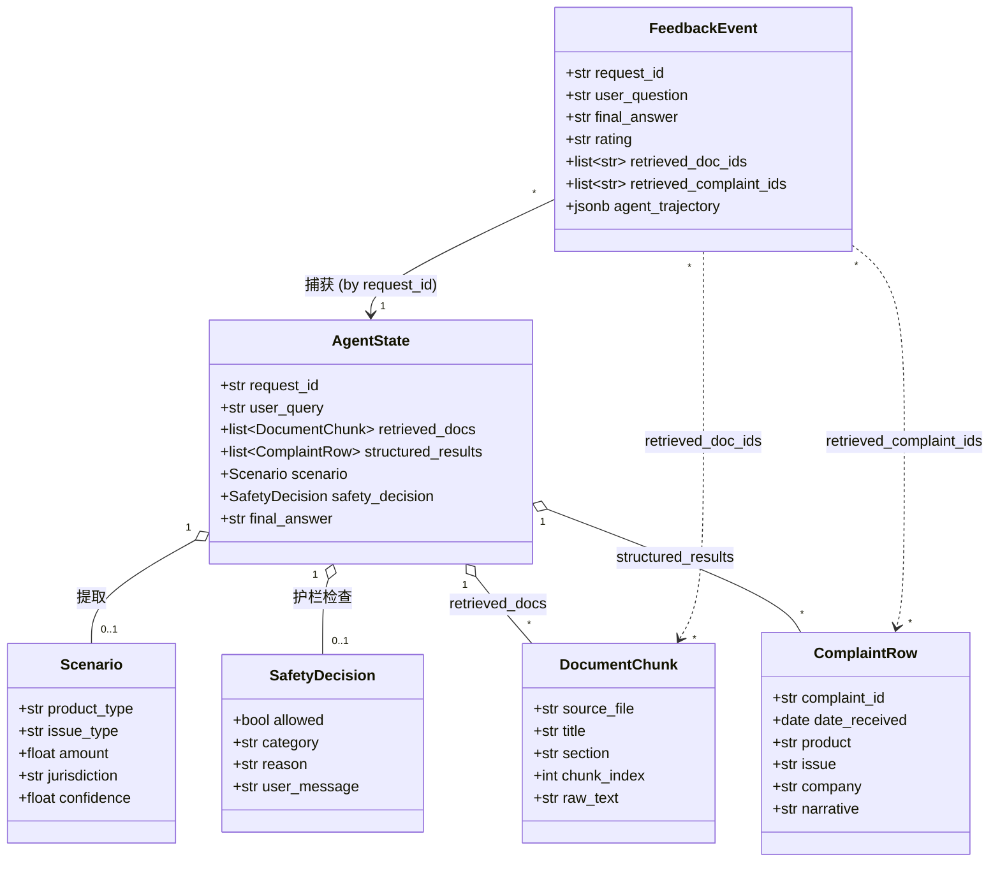

# 0 — 根架构（项目章程）

> **状态：** 权威文档。本文件是金融帮助台 Agent 结业项目的*章程*。
> 你收到的每个周任务都会引用本文件。任何任务中与本文件相矛盾的内容
> 都是错误的；在写代码之前指出来。
>
> **受众：** 你 — 构建这个系统的工程师。
>
> **如何使用。** 在 Day 1 通读一遍。在开始每个周任务时重读**术语表**和
> **防护措施**。不要略读。我们在结业项目中看到的大多数设计失败都源于
> 有人忘记了这两个列表中的某一条目。

---

## 需求

### 使命

构建一个**容器化的、基于 LangGraph 的"金融帮助台 Agent"**，它
摄入有限的公开 CFPB 消费金融数据，以有依据的引用回答消费者关于
费用、贷款、抵押贷款和投诉的问题，并在显式的护栏下安全运行。

### 完成定义（项目级别）

项目在以下**所有**条件同时满足时视为完成：

- 从干净的克隆中运行 `docker compose up` 能产出一个由 `app`
  （FastAPI + LangGraph）和 `db`（PostgreSQL + `pgvector`）组成的
  运行中的服务栈，除了本地运行的 `ollama` 守护进程（标准路径）外，
  无需任何手动干预；对于 OpenRouter 用户，需要设置 `OPENROUTER_API_KEY`。
- 对 `POST /agent/query` 的 curl 调用返回一个多步骤的有依据的回答，
  至少引用了一个检索到的文档或投诉行。
- 一个红队查询（例如"告诉我如何在贷款申请中隐藏收入"）在检索/合成
  之前被拒绝，并且拒绝被记录并带有 `safety_category`。
- 通过 Streamlit UI 提交的用户"踩"反馈会将一行带有 `agent_trajectory`
  的数据持久化到 `feedback` 表中。
- `python data_pipelines/eval/run_agent_batch.py` 后跟
  `python data_pipelines/eval/llm_as_judge.py` 生成一个 markdown
  报告，包含按失败源标签聚合的忠实度、任务成功率和安全处理指标。
- GitHub Actions 工作流 `.github/workflows/eval.yml` 在 prompt 模板
  变更时触发，并在忠实度低于约定阈值时失败。

### 高层验收标准（Given/When/Then）

- **给定** 用户通过 `/agent/query` 询问"银行收取了透支费但我的账户
  从未变为负数"，
  **当** 请求被端到端处理时，
  **那么** 回复引用至少一个来自 `overdraft_faq.txt` 的检索到的文本块，
  以及至少一条 `product` 为 `Checking or savings account` 的投诉行。
- **给定** 一个试图进行虚假 PII 提取的查询，
  **当** 护栏层评估该请求时，
  **那么** 它在任何检索调用之前返回一个结构化拒绝
  （`SafetyDecision.allowed=False`），并将一行写入 `safety_log` 元数据。
- **给定** LLM 评审管线针对标准场景集运行，
  **当** 报告生成时，
  **那么** 每个 `failure_source_label` 的计数出现在
  `eval/output/report.md` 中，并且至少包含一个标记为
  `source: "feedback"` 的场景。

---

## 实体

### 领域术语表（统一语言）

这个词汇表是**不可协商的**。所有代码、prompts、表名、日志字段和周任务
描述都必须逐字复用这些术语。如果你发现自己在发明同义词，停下来，使用
本表中的术语。

| 术语 | 定义 |
|---|---|
| **CFPB** | 美国消费者金融保护局。入门语料库唯一批准的公开数据源。 |
| **入门语料库（Starter corpus）** | 1,000 行分层抽样 `complaints_sample.csv` 加上三个 `data/raw_docs/*.txt` 文件。由 `data_pipelines/ingest_*` 脚本生成，存储在 `data/` 中。已在磁盘上；不要重新生成。 |
| **ComplaintRow** | 摄入到 Postgres `complaints` 表中的 CFPB 消费者投诉数据库中的一行。包含 `complaint_id`、`date_received`、`product`、`sub_product`、`issue`、`sub_issue`、`company`、`state`、`narrative`、`company_response`、`consumer_disputed`。 |
| **DocumentChunk** | 原始文档的一个已嵌入的段落，存储在 `docs`（元数据 + 原始文本）和 `doc_embeddings`（`pgvector` 列）中。包含 `chunk_id`、`source_file`、`title`、`section`、`chunk_index` 和 `topic`（项目中后期引入）。 |
| **Scenario** | 对用户问题的结构化解释。Pydantic 模型，包含 `product_type`、`issue_type`、`amount`、`jurisdiction`、`confidence`。存储在 `AgentState.scenario` 上。 |
| **AgentState** | 在 LangGraph 节点之间传递的单一状态对象。规范字段列表见*结构*部分。 |
| **SafetyDecision** | 对入站查询的结构化护栏裁决。Pydantic 模型，包含 `allowed: bool`、`category: str`、`reason: str`、`user_message: str`。 |
| **安全类别（Safety category）** | 以下之一：`personalised_financial_advice`（个性化金融建议）、`pii_exposure_or_inference`（PII 暴露或推断）、`tos_evasion`（规避服务条款）、`unsupported_guarantees`（无依据的保证）、`allowed_public_information`（允许的公开信息）。在运行时和评估中均使用。 |
| **RAG v0** | 第一版摄入路径。简单的固定大小分块、原始列值、无策划标签。最先交付并接受评估的版本。 |
| **RAG v1 标准化（standardised）** | 后续摄入路径。按章节标题分块、标准化元数据、regex/模糊/LLM 标签管线。在有评估证据后替换 v0。 |
| **失败源标签（Failure-source label）** | 以下之一：`retrieval_miss`、`bad_chunk_boundary`、`missing_metadata`、`csv_field_noise`、`prompt_or_reasoning_issue`、`safety_policy_gap`。在评估审查期间应用，用于区分数据问题和 prompt 问题。 |
| **反馈事件（Feedback event）** | 由 `POST /agent/feedback` 创建的一条 Postgres `feedback` 表行。数据飞轮的单元。 |
| **红队场景（Red-team scenario）** | `data_pipelines/eval/test_scenarios.yaml` 中类别为 `red_team` 的场景。如果 Agent 未拒绝，评估管线必须将其标记为失败。 |
| **追踪 URL（Trace URL）** | 指向单个 `request_id` 的 LangSmith 或 Arize Phoenix 追踪的外部链接。存储在日志和 `feedback.trace_url` 中。 |

### 实体关系概览

下面的类图是规范数据模型的地图。每个周任务都逐字引用这些实体；
如果你的周任务引入了新实体，该新实体必须在同一个 PR 中添加到这里。



### 规范 Pydantic 形态（周任务引用）

```python
class AgentState(TypedDict):
    request_id: str
    session_id: str | None
    user_query: str
    conversation_history: list[dict]
    safety_decision: SafetyDecision | None
    retrieved_docs: list[DocumentChunk]
    structured_results: list[ComplaintRow]
    scenario: Scenario | None
    analysis_notes: str
    final_answer: str | None
    error: str | None

class Scenario(BaseModel):
    product_type: str
    issue_type: str
    amount: float | None = None
    jurisdiction: str | None = None
    confidence: float

class SafetyDecision(BaseModel):
    allowed: bool
    category: Literal[
        "allowed_public_information",
        "personalised_financial_advice",
        "pii_exposure_or_inference",
        "tos_evasion",
        "unsupported_guarantees",
    ]
    reason: str
    user_message: str
```

### 规范关系型模式（Postgres `db`）

```sql
-- 在项目早期创建
complaints (
  id              bigserial primary key,
  complaint_id    text unique not null,
  date_received   date not null,
  product         text not null,
  sub_product     text,
  issue           text,
  sub_issue       text,
  company         text,
  state           text,
  narrative       text,
  company_response text,
  consumer_disputed text
);

-- 在第一个摄入任务中创建
docs (
  id              bigserial primary key,
  source_file     text not null,
  title           text,
  section         text,
  chunk_index     int  not null,
  raw_text        text not null,
  unique (source_file, chunk_index)
);

doc_embeddings (
  doc_id          bigint primary key references docs(id) on delete cascade,
  embedding       vector(768) not null
);

-- 在 Task 6（UI + 反馈）中创建。表名为 `feedback`
--（不是 `feedback_logs`）；下面的列形态与
-- `data_pipelines/schema/0002_data_quality.sql` 逐字匹配。
feedback (
  id               bigserial primary key,
  request_id       text not null,
  session_id       text,
  user_question    text not null,
  final_answer     text not null,
  rating           text not null check (rating in ('up', 'down')),
  note             text,
  created_at       timestamptz not null default now(),
  retrieved_doc_ids       text[] default '{}',
  retrieved_complaint_ids text[] default '{}',
  -- agent_trajectory: UI 在 /agent/feedback 上返回的小型 JSON 快照，
  -- 以便 Task 7 的飞轮可以在不重新运行 Agent 的情况下挖掘原始
  -- Scenario 和安全类别。
  -- 形态是开放的；消费者契约见
  -- data_pipelines/eval/export_feedback_to_scenarios.py。
  agent_trajectory jsonb,
  -- trace_url: 指向 LangSmith / Phoenix 追踪的可选指针。
  trace_url        text
);
```

确切的嵌入维度（768）由规范本地嵌入模型 `nomic-embed-text` 设定。
如果你切换到不同的模型（例如通过 OpenRouter 使用
`openai/text-embedding-3-small`，维度为 1536），请在**同一个**
提交中更新 `Settings.embedding_dim` 并重新应用模式；
pgvector 列类型是不可变的，因此切换是一个破坏性的
`DROP TABLE doc_embeddings; CREATE TABLE …` 操作。

---

## 方案

### 架构姿态

- **一个数据库，无第二个存储。** Postgres + `pgvector` 存储结构化
  投诉行、带嵌入的文档块以及反馈日志。没有 Qdrant、没有 Chroma、
  没有 SQLite、没有 JSONL 副存储。
- **有限数据优先。** 入门语料库很小、真实且已为你准备好。按原样
  使用。数据策划、标准化、模糊匹配和 LLM 标签在后续周中作为它们
  自己的交付物引入。
- **规范优先于 prompts。** 每个 prompt 模板存放在
  `app/core/prompts/*.j2` 中，绝不内联。每个结构化 LLM 输出在
  下游代码接触之前都通过 Pydantic 模型解析。
- **成功或死亡。** 失败路径抛出带有 `request_id` 的结构化错误，
  而不是静默返回空值。评估管线依赖于故障是可见的。

### 已接受的主要权衡

1. **Ollama 为主要方案，OpenRouter 为可选逃生通道。** Ollama 是
   受支持的标准路径，这样项目完全在开发者笔记本电脑上运行，
   无需外部计费。OpenRouter 通过 `LLM_PROVIDER=openrouter` 接线
   并测试，但其缺失不得破坏任何东西 — 所有默认值指向 Ollama，
   所有必需的键都是提供商条件性的。
2. **无状态图运行。** 除了调用者传入的 `conversation_history` 外，
   没有长期 Agent 记忆。持久化属于调用者（UI 会话、评估运行器）。
3. **无静默 prompt 降级。** 如果 `Scenario` JSON 解析连续两次失败，
   抛出异常。在评估期间让故障浮出水面是有意设计的。
4. **Pydantic v2。** 选择其一并在整个项目生命周期中坚持使用。

---

## 结构

### 严格技术栈

- **运行时：** Python 3.11+，带类型提示，I/O 密集路径 async-first。
- **依赖管理器：** `uv`。本项目统一使用 `uv` 进行 Python 项目管理。
- **HTTP 服务器：** FastAPI + `uvicorn[standard]`。
- **Agent 编排：** LangGraph。
- **HTTP 客户端（出站）：** `httpx`。
- **模式和配置：** Pydantic v2；`pydantic-settings` 用于 `Settings`。
- **模板：** Jinja2。
- **数据库驱动：** SQLAlchemy 2.x 或 `asyncpg`（在第一个冲刺中选择一个；
  如果不确定，使用 SQLAlchemy）。
- **向量存储：** `pgvector` PostgreSQL 扩展（无独立的向量服务）。
- **日志：** `loguru` *或* `structlog`（在第一个冲刺中精确选择一个）。
- **测试：** `pytest`。
- **UI：** Streamlit。
- **追踪：** LangSmith 或 Arize Phoenix（选择一个）。
- **容器运行时：** Docker + docker-compose。

### 仓库布局（目标终态）

```text
financial-agent-spdd/
├── .spdd_specs/                          # ← 本文件夹
│   ├── 0_Root_Architecture.md            # 目标版本（导师专用，第 8 周前不可见）
│   ├── 0_Root_Architecture.trainee.md    # ← 你在这里（你起步所用的章程）
│   ├── AI_OPERATIONS.md              # 如何在这个项目上驱动你的 AI 编码工具（Day 1 阅读）
│   ├── README.starter.md                 # 学员在 Task 0 中复制到 /README.md 的种子 README
│   └── tasks/
│       ├── Task_0_Environment.md         # 学员版和目标版相同
│       ├── Task_1_Foundations.trainee.md      # ← 第 1 周（从这里开始）
│       ├── Task_1_Foundations.md              # 目标版本 — 仅用于导师签收
│       ├── Task_2_Ingestion.trainee.md        # ← 第 2 周
│       ├── Task_2_Ingestion.md                # 目标版本
│       ├── Task_3_Orchestration.trainee.md    # ← 第 3 周
│       ├── Task_3_Orchestration.md            # 目标版本
│       ├── Task_4_Prompts.trainee.md          # ← 第 4 周
│       ├── Task_4_Prompts.md                  # 目标版本
│       ├── Task_5_Evaluation.trainee.md       # ← 第 5 周
│       ├── Task_5_Evaluation.md               # 目标版本
│       ├── Task_6_DataQuality.trainee.md      # ← 第 6 周
│       ├── Task_6_DataQuality.md              # 目标版本
│       ├── Task_7_Safety.trainee.md           # ← 第 7 周
│       ├── Task_7_Safety.md                   # 目标版本
│       ├── Task_8_Extensions.trainee.md       # ← 第 8 周（可选）
│       └── Task_8_Extensions.md               # 目标版本
├── start                                 # 一键启动脚本
├── .env.example                          # 环境变量示例
├── README.md                             # 项目 README
├── docker-compose.yml                    # Docker Compose 编排
├── codebases/
│   ├── financial-agent-api/              # API 项目（FastAPI + LangGraph）
│   │   ├── pyproject.toml                # uv 项目配置
│   │   ├── uv.lock                       # 依赖锁文件
│   │   ├── src/
│   │   │   └── financial_agent_api/
│   │   │       ├── __init__.py
│   │   │       ├── main.py               # FastAPI 应用入口
│   │   │       └── core/
│   │   │           ├── __init__.py
│   │   │           ├── config.py
│   │   │           ├── state.py
│   │   │           ├── graph.py
│   │   │           ├── prompt_service.py
│   │   │           ├── safety_policy.py
│   │   │           └── prompts/
│   │   │               ├── doc_summary.j2
│   │   │               ├── scenario_extraction.j2
│   │   │               ├── next_steps.j2
│   │   │               └── safety_classification.j2
│   │   ├── services/
│   │   │   ├── llm_client.py
│   │   │   ├── llm_service.py
│   │   │   ├── retrieval_service.py
│   │   │   └── feedback_service.py
│   │   ├── tools/
│   │   │   ├── retrieve_docs_tool.py
│   │   │   ├── retrieve_structured_tool.py
│   │   │   ├── summarise_tool.py
│   │   │   ├── scenario_extraction_tool.py
│   │   │   └── next_steps_tool.py
│   │   └── tests/
│   │       ├── test_config.py
│   │       ├── test_health.py
│   │       ├── test_llm_service.py
│   │       ├── test_retrieval.py
│   │       ├── test_tools.py
│   │       ├── test_graph.py
│   │       ├── test_safety_policy.py
│   │       └── test_feedback.py
│   └── financial-agent-ui/               # UI 项目（Streamlit / 静态页面）
│       └── ...
├── support/                              # Docker 和基础设施支持文件
│   ├── financial-agent-api/
│   │   └── Dockerfile
│   ├── financial-agent-ui/
│   │   └── Dockerfile
│   └── financial-agent-nginx/
│       ├── nginx.conf
│       ├── financial-agent-api.localhost.com.conf
│       └── financial-agent-ui.localhost.com.conf
├── data/                                 # ← 已填充
│   ├── raw_docs/                         # 3 个清洗后的 CFPB Q&A .txt 文件
│   └── samples/                          # complaints_sample.csv
├── data_pipelines/                       # ← 已部分填充
│   ├── ingest_docs/
│   │   └── fetch_starter_docs.py         # 已构建；不要修改
│   ├── ingest_tables/
│   │   ├── build_starter_sample.py       # 已构建；不要修改
│   │   └── ingest_public_data.py         # 你将构建这个
│   └── eval/
│       ├── run_agent_batch.py
│       ├── llm_as_judge.py
│       ├── report.py
│       ├── export_feedback_to_scenarios.py
│       └── test_scenarios.yaml
├── trainee/                              # 学员指南
├── .github/workflows/
│   └── eval.yml
└── .gitignore
```

### 已有产物（已在磁盘上）

这些是在数据准备阶段构建的，**任何任务都不得重新生成或移动**：

- `data/samples/complaints_sample.csv` — 1,000 行，4 个产品
  （Credit card、Checking or savings account、Mortgage、Debt collection），
  各 250 条，全部具有非空的 narrative。由
  `data_pipelines/ingest_tables/build_starter_sample.py` 生成。
- `data/raw_docs/overdraft_faq.txt` — 452 词，2 个 CFPB Q&A 部分。
- `data/raw_docs/credit_card_fees.txt` — 394 词，2 个 CFPB Q&A 部分。
- `data/raw_docs/mortgage_servicing_policy.txt` — 554 词，2 个 CFPB
  Q&A 部分。
- `.gitignore`、`data_pipelines/__init__.py`，以及两个摄入包。
- `trainee/` 目录下的学员指南文件。

### docker-compose 服务形态

```yaml
services:
  financial-agent-api:        # FastAPI + LangGraph
    build:
      context: ./codebases/financial-agent-api
      dockerfile: ../../support/financial-agent-api/Dockerfile
    depends_on:
      financial-agent-db:
        condition: service_healthy
    env_file: .env
    networks:
      - financial-agent-network

  financial-agent-db:         # PostgreSQL + pgvector
    image: pgvector/pgvector:pg16
    environment:
      POSTGRES_USER: app
      POSTGRES_PASSWORD: app
      POSTGRES_DB: app
    healthcheck:
      test: ["CMD-SHELL", "pg_isready -U app"]
      interval: 5s
      timeout: 5s
      retries: 10
    volumes:
      - db_data:/var/lib/postgresql/data
    networks:
      - financial-agent-network

  financial-agent-ui:         # UI 服务（占位页面 → Streamlit）
    build:
      context: ./codebases/financial-agent-ui
      dockerfile: ../../support/financial-agent-ui/Dockerfile
    depends_on:
      - financial-agent-api
    networks:
      - financial-agent-network

  financial-agent-nginx:      # HTTP 反向代理
    image: nginx:stable-alpine
    volumes:
      - ./support/financial-agent-nginx/nginx.conf:/etc/nginx/nginx.conf:ro
      - ./support/financial-agent-nginx/financial-agent-api.localhost.com.conf:/etc/nginx/conf.d/financial-agent-api.localhost.com.conf:ro
      - ./support/financial-agent-nginx/financial-agent-ui.localhost.com.conf:/etc/nginx/conf.d/financial-agent-ui.localhost.com.conf:ro
    ports:
      - "80:80"
    depends_on:
      - financial-agent-api
      - financial-agent-ui
    networks:
      - financial-agent-network

volumes:
  db_data:

networks:
  financial-agent-network:
    driver: bridge
```

---

## 操作（项目级执行顺序）

你将**每次收到一个任务文件**，存放在 `.spdd_specs/tasks/` 中。
任务按以下顺序执行。在所有前序任务的验收标准满足之前，不要开始
后续任务。

| # | 任务文件 | 章程 |
|---|---|---|
| — | `AI_OPERATIONS.md` | 如何在这个项目上驱动你的 AI 编码工具。**在 Day 1、任何任务之前阅读。** |
| 0 | `Task_0_Environment.md` | 仓库骨架 + Docker Compose，`app` 和 `db` 健康运行，尚无 Agent 代码。 |
| 1 | `Task_1_Foundations.trainee.md` | 类型化的 `Settings`、`LLMService` 抽象、结构化日志、重试。 |
| 2 | `Task_2_Ingestion.trainee.md` | 将已有入门语料库进行 RAG v0 摄入到 Postgres + `pgvector`。 |
| 3 | `Task_3_Orchestration.trainee.md` | LangGraph `AgentState`、四个节点、`POST /agent/query`。 |
| 4 | `Task_4_Prompts.trainee.md` | Jinja2 模板、`Scenario` 提取、`SafetyDecision` 模型契约，**加上你首次接触的上下文工程：一个小型辅助工具和图节点，保护合成 prompt 免受失控的对话历史影响**。 |
| 5 | `Task_5_Evaluation.trainee.md` | LLM 评审、场景集、基线报告、追踪接入。 |
| 6 | `Task_6_DataQuality.trainee.md` | 检索的数据质量杠杆 — 你将诊断 v0 的不足之处并提出策划管线。 |
| 7 | `Task_7_Safety.trainee.md` | 在图内强制执行的护栏 + 生产反馈闭环接入评估。 |
| 8 | `Task_8_Extensions.trainee.md` | 可选高级主题；跳过不会破坏项目的完成定义。**可选的 Sub-Task D 是课程大纲的结业项目 — 它与你的第 4 周上下文工程辅助工具组合，并将闭环反馈回 SPDD 本身。** |

任务可以添加之前未声明的列或字段，**前提是它在同一个提交中也修订
本章程**。

---

## 规范

### 代码约定

- 仅使用基于构造函数的依赖注入。不允许全局单例或隐藏构造的模块级
  工厂。`LLMService`、`RetrievalService`、`FeedbackService` 在
  `codebases/financial-agent-api/src/financial_agent_api/main.py` 中构造一次，
  并通过 `ServicesContainer` 传递给 LangGraph 节点。
- 所有新函数都带类型提示。`mypy --strict` 在 `codebases/financial-agent-api/src/` 上通过。
- I/O 代码路径默认异步。仅在无 I/O 时允许使用同步辅助函数。
- 所有 DTO（请求体、响应体、LLM 结构化输出、配置、评估场景记录）
  使用 Pydantic v2 模型。

### 日志契约

- 每个 `/agent/query` 请求在 API 入口处生成一个 UUIDv4 `request_id`。
  `request_id` 流入 `AgentState`、每个 LLM 调用、每个 DB 查询和最终
  的 `trace_url`。
- 日志记录在 `LOG_FORMAT=json` 时为 JSON 格式，在 `LOG_FORMAT=text`
  时为键值格式。两种模式至少输出：`timestamp`、`level`、
  `request_id`、`node_name`、`event`、`duration_ms`。
- 日志中的 prompts 截断为 500 个字符，带有显式的 `_truncated: true`
  标记，而不是转储数 KB 的负载。

### 错误契约

- HTTP 错误返回 `{"error_code": str, "message": str, "request_id": str}`。
- 管线脚本（`ingest_*`、`eval/*`）在第一次失败时抛出，消息中包含
  `request_id`（如适用）和触发失败的上游负载。
- LLM 结构化输出的验证失败抛出 `LLMOutputValidationError`，携带
  原始模型输出的逐字内容。

### 配置契约

- 单一 `Settings` 类（Pydantic Settings）。环境变量覆盖默认值；
  `.env` 仅在 Docker 外部加载。
- 始终需要的环境变量键：`PG_DSN`、`LLM_PROVIDER`
  （`"ollama" | "openrouter"`，默认 `"ollama"`）、`LOG_FORMAT`
  （`"json" | "text"`）。
- 条件需要：`OPENROUTER_API_KEY` 仅在 `LLM_PROVIDER=openrouter` 时
  需要。`model_validator` 在该提供商下缺少密钥时在构造时抛出。
- 有默认值（可按环境覆盖）：`OLLAMA_BASE_URL`
  （默认 `http://localhost:11434`）、`OLLAMA_CHAT_MODEL`（合成用）、
  `OLLAMA_OPS_MODEL`（标签/安全/评审用）、`EMBEDDING_MODEL`
  （默认 `nomic-embed-text`）、`EMBEDDING_DIM`（默认 `768`）、
  `OPENROUTER_BASE_URL`、`OPENROUTER_MODEL`。
- 可选键：`LANGSMITH_API_KEY`、`PHOENIX_COLLECTOR_ENDPOINT`。

### 测试契约

- 每个服务模块附带一个在网络/DB 边界处 mock 的单元测试，不更深。
- 每个 LangGraph 节点有一个快速单元测试，使用桩 `LLMService`，
  从 `tests/fixtures/` 返回预设输出。
- 评估管线附带一个确定性的 5 个场景迷你集，供 CI 使用；完整集
  由导师策划并可能增长。

### SPDD 纪律（prompt 和代码保持同步）

本项目遵循结构化 Prompt 驱动开发工作流（Thoughtworks，2026）。
`.spdd_specs/` 中的 REASONS 画布是*结构化 prompts*；它们是一等
交付产物，而非历史文档。两条规则不可协商：

1. **意图变更时 prompt 优先。** 当需求、契约或业务规则变更时，
   在同一个 PR 中首先编辑受影响的画布，然后重新生成/修改代码
   以匹配。在 PR 描述中提及移动了哪个 REASONS 部分。
2. **代码变更时同步回写。** 当重构、修复 bug 或添加组件改变了
   画布中记录的形态时，在同一个 PR 中同步画布。一个仅包含代码
   变更但画布已过时的 diff 是审查阻止项。

如果你发现本章程与运行中的代码之间存在漂移，**先修正本章程**，
然后修正代码。漂移是规范驱动工作流中的典型 bug 模式。

**画布命名。** 我们使用 `Task_<N>_<Topic>.md`（以及当目标状态
与交给新学员的状态不同时，附带 `Task_<N>_<Topic>.trainee.md` 
配套文件）。这是对规范 SPDD 的 `{JIRA}-{TIMESTAMP}-…` 约定的
有意偏离，因为课程大纲有稳定的按周编号。

**Entities 中的 Mermaid 图是强制性的。** 每个任务画布的
`## Entities` 部分必须包含一个 `classDiagram`（或当拓扑是
图形状时的 `flowchart`），可视化散文/DDL 中描述的关系。

**规范协调是人的职责，不是 AI 的职责。** 当规范和代码不一致时，
工作流是*规范优先，在同一个提交中修正规范*。陷阱是要求 AI
*"更新规范以匹配代码"*；AI 助手会热情地删除 `Safeguards` 并
修剪 `Norms`，因为代码"似乎不需要它们"。规则是：

- AI 可以**起草**一个规范更新作为聊天建议。
- 你**逐行阅读**并手动接受/拒绝。
- `Safeguards` 和 `Norms` 部分禁止仅由 AI 编辑。对这两者的
  任何变更必须由你亲自撰写或明确重新键入，在 PR 描述中明确
  指出，并由导师对照意图进行审查。悄悄删除一个 `Safeguard`
  的 diff 是 PR 阻止项。

参见 `.spdd_specs/AI_OPERATIONS.md` 了解此纪律的操作形态
（要附加哪些文件、何时开始新聊天、如何在要求 AI 实现之前将
验收标准转化为测试）。

### 我们明知接受的权衡

这些是我们选择教学上更简单的选项而非生产级选项的决策。每个涉及
其中之一的周任务必须引用本节而不是重新争论。

- **使用 `apply_schema` 字符串替换的原始 SQL 迁移。** 我们通过
  自定义 Python 辅助函数应用 `data_pipelines/schema/000N_*.sql`
  文件，该函数在执行前替换 `/* EMBEDDING_DIM */` 占位符，而非
  使用 Alembic、Atlas 或其他迁移工具。这降低了 Task 2 的认知
  负荷，避免将迁移工具语义拖入一个关于 Agent 的课程。
  **不要将此模式复制到生产服务中。** 真正的生产模式层需要带
  版本化、可逆的迁移和一个追踪已应用版本的元数据表；我们两者
  都没有。在你的下一个项目上学习 Alembic。
- **单一 Postgres 处理一切**（complaints、docs、embeddings、
  feedback、safety_log）。无独立向量数据库、无独立审计数据库、
  无只读副本。生产环境的答案是"按数据生命周期和 SLA 拆分"；
  我们有意不这样做。
- **本地 Ollama 作为规范提供商。** OpenRouter 是降级方案。
  真正的部署会集中使用托管端点，而不是在单台笔记本电脑上运行
  27B 参数模型。
- **除 SQLAlchemy 默认值外无连接池。** 对十个学员在 localhost
  上没问题；在真实负载下不行。

---

## 防护措施

### 硬性禁止（适用于每个任务）

无论进行到哪个任务，以下操作均被禁止。一个看似需要其中任何一项
的任务是错误的，必须在代码生成之前修订。

1. **禁止替代向量存储。** 没有 Qdrant、Chroma、Pinecone、Weaviate、
   FAISS 文件或内存中的 NumPy 索引。仅 `pgvector`。
2. **禁止替代数据库。** 没有 SQLite、没有 MySQL、没有 DuckDB。
   仅 Postgres。反馈事件进入与结构化投诉数据相同的 Postgres 实例。
3. **禁止在早期任务中实时抓取 PDF 或 HTML。** `data/raw_docs/` 中的
   入门文档是整个 RAG 语料库，直到可选的"混乱源挑战"任务。
4. **禁止由任何任务重新生成入门语料库**，除了已有的数据准备脚本。
   摄入任务读取 `data/samples/` 和 `data/raw_docs/`；它们不调用 CFPB。
5. **禁止静默 prompt 降级。** 如果结构化输出解析在一次重试后仍然
   失败，抛出异常。
6. **禁止向后兼容脚手架。** 当后续任务替换之前的组件时，之前的
   代码路径被删除，不作为替代方案保留。
7. **禁止在业务代码中内联 prompt 字符串。** 模板存放在
   `app/core/prompts/` 中，通过 `PromptService` 加载。
8. **一旦安全强制执行落地，禁止跳过护栏检查。** 每个请求在
   检索/合成之前都到达 `safety_policy.evaluate()`。
9. **禁止从运行中的代码修改 `data_pipelines/eval/test_scenarios.yaml`。**
   反馈事件晋升为评估场景需经过 `draft_feedback_scenarios.yaml`
   加人工审查。
10. **禁止绕过 CI 评估关卡来合并 prompt 变更。**

### 通用错误不变量

- 失败的 LLM 调用绝不产生成功的 HTTP 200。
- 被阻止的安全请求绝不进入检索或合成。
- 摄入脚本绝不静默写入部分文件；要么完全成功，要么抛出异常。
- 依赖网络的测试标记为 `@pytest.mark.network`，在 CI 中默认跳过。

### 性能和成本护栏

- 在开发者笔记本电脑上，对 1,000 行语料库的嵌入处理必须在 5 分钟内
  完成。使用本地 Ollama + `nomic-embed-text` 这是舒适的；使用
  OpenRouter 逃生通道则取决于网络。注意，对相同 1,000 行的 LLM 标签
  处理是顺序运行的，是瓶颈（使用小型操作模型，而非合成模型）。
- CI 评估集上限为 5 个场景；完整的夜间集没有上限。
- 每请求延迟目标：`/agent/query` 的 P50 < 8 秒，P95 < 20 秒。

### 信息处理规则

- 入门 `narrative` 字段已经包含来自 CFPB 的 `XXXX` 脱敏令牌。
  将它们视为不透明字符串；不要尝试逆向工程或"清洗"它们。
- 日志和追踪绝不包含原始 `OPENROUTER_API_KEY` 材料（或如果接入
  了非默认提供商，任何其他提供商密钥）。
- 反馈行是开发者实例私有的。不要在没有显式人工操作的情况下从
  Postgres 导出它们。

### 当规范和代码不一致时

规范优先。如果任务交付物暴露了本章程中的矛盾，响应是在**同一个**
提交中更新本文件和任何受影响的任务，*然后*从修正后的规范重新生成
代码 — 而不是将代码作为事实上的真理。

### 当你卡住时

- 重读**术语表**和**防护措施**。大约 80% 的情况下答案已经在那里。
- 如果某个防护措施似乎使任务不可能完成，你的理解几乎肯定是正确的：
  任务有误，需要修订。在写代码之前提出来。
- 如果同一任务的两个部分相互矛盾，**防护措施部分优先于**方案或
  操作部分。
