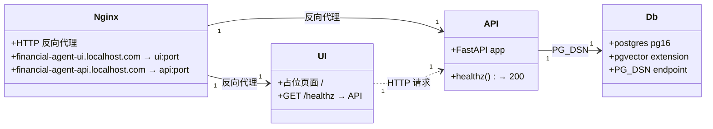

# Task 0 — 环境搭建（REASONS 画布）

> **映射到：** 学习计划第 0 周 — *环境搭建与项目骨架*。
> **依赖：** 仅依赖 `0_Root_Architecture.md`。
> **解锁：** `Task_1_Foundations.md`。

---

## 需求

基于`0_Root_Architecture.md`，为项目进行环境搭建和项目骨架搭建。

### 分析上下文

**扫描到的领域关键词：** docker compose、FastAPI、postgres、
pgvector、healthz

**策略方向：** 将 Day-1 的覆盖面保持在最小范围。

1. 搭建最基础的API项目，仅仅提供一个`healthz`端口，返回200,OK，使用uv进行python项目管理，限制依赖版本
2. 搭建最基础的UI项目，参考基础宪章中的技术选型，通过访问 `/` 能够得到一个空的占位符页面
3. 为方便本地开发，支持使用基于Docker compose的一键启动功能
4. 考虑到API项目未来需要依赖postgres,pgvector，因此，需要搭建postgresql数据库，作为API项目的依赖项

### 为什么需要这个任务

一个初级开发者应该能够从干净的仓库克隆中运行 `docker compose up`，
并在几分钟内看到一个健康的服务栈。Agent 在后续任务中的正确性依赖于
一个可复现的运行时环境，后续的每一个组件（Postgres、embeddings、
LangGraph、评估）都接入同一个容器拓扑。没有这个脚手架，下游的每个
Task 都会花时间在基础设施上折腾，而不是构建功能。

### 验收标准（Given/When/Then）

- **给定** 仓库的一个干净克隆
  **当** 开发者运行 `./start` 时，
  **那么** 会在Docker中创建应用 `financial-agent-spdd`,其中有四个服务 `financial-agent-ui`, `financial-agent-db`, `financial-agent-api` 和 `financial-agent-nginx` 四个服务都应达到健康状态
- **给定** 所有服务正在运行
  **当** 浏览器访问 `http://financial-agent-ui.localhost.com`
  **那么** 一个带有占位符信息的页面能够被正常展示，并切可以看到一条访问API服务的请求 `GET http://financial-agent-api.localhost.com/healthz` 被发出，且正确返回状态码200，内容时OK，浏览器页面上展示响应
- **给定** 所有服务正在运行
  **当** 使用数据库连接工具创建连接后
- **那么** `pgvector` 扩展已安装（`CREATE EXTENSION IF NOT EXISTS vector` 能无错误地成功执行）

### 本任务的明确非目标

- 不在API项目中添加任何和请求 `healthz` 不相关的内容
- 不在UI项目中添加任何和 `/` 页面不相关的内容

---

## 实体

| 实体                      | Task 0 注意事项                                                      |
|-------------------------|------------------------------------------------------------------|
| `financial-agent-api`   | FastAPI 服务，仅提供 `GET /healthz` 返回 `{"status":"ok"}`。使用 `uv` 管理依赖。 |
| `financial-agent-ui`    | 前端占位页面服务，访问 `/` 展示占位信息，并请求 API `/healthz` 展示响应。                  |
| `financial-agent-db`    | PostgreSQL 16 + pgvector 扩展。使用 `pgvector/pgvector:pg16` 镜像。      |
| `financial-agent-nginx` | HTTP 反向代理，将域名路由到对应服务（ui/api）。                                    |
| `pgvector`              | Postgres 扩展。必须在所选镜像中可用；首选 `pgvector/pgvector:pg16` 镜像，无需安装步骤。    |

### 部署拓扑概览

Task 0 是唯一拥有运行时*拓扑*（而非数据形态）的 Task，
因此该图是启动过程的类级别视图：哪些容器与哪些容器通信。



---

## 方案

### 设计决策

1. API项目需要借助 `uv` 进行版本管理
2. UI项目需要使用基础宪章中的提到的技术进行实现
3. NGINX项目目前只需要使用HTTP即可，其反向代理的域名通过在hosts文件中进行配置实现正确路由，因此，在启动的时候，需要预先检查是否有配置对应的hosts到127.0.0.1的配置，如果没有，则提示用户提供sudo执行所需密码，直接进行修改
4. API项目自身的所有代码放到 `<rootDir>/codebases/financial-agent-api` 下
5. API项目自身的所有代码放到 `<rootDir>/codebases/financial-agent-ui` 下
6. 所有docker compose 服务相关的文件，如Dockerfile, env等，放到对应的support目录下，比如 `<rootDir>/support/financial-agent-nginx/financial-agent-api.localhost.com.conf`, `<rootDir>/support/financial-agent-api/Dockerfile`
7. **`db` 服务使用 `pgvector/pgvector:pg16` 镜像**。通过选择已内置
   扩展二进制文件的镜像，避免"启动时安装扩展"的额外步骤。
8. 依赖版本需要参考基础宪章，如未定义，则使用最新的可以互相兼容的稳定版本
9. API项目中，需要针对每个模块有对应的测试模块，并能够成功执行

### 已接受的权衡

- Dockerfile 在运行时镜像中安装完整的项目 venv。这是浪费但简单的做法；
  Task 6 的多阶段构建将缩小镜像体积。
- 仓库结构在本 Task 中预先创建，即使大多数文件夹在后续 Task 中才会
  填充。这是有意为之：从一开始保持布局稳定，防止 AI 在代码生成过程中
  "发现"替代位置。

---

## 执行计划

按以下步骤顺序执行：

1. **搭建 API 项目** (`codebases/financial-agent-api/`)：使用 `uv` 管理 Python 项目，FastAPI 框架，仅 `GET /healthz` 端点返回 `{"status":"ok"}`，包含 `tests/` 测试模块
2. **搭建 UI 项目** (`codebases/financial-agent-ui/`)：基础占位页面，访问 `/` 展示占位信息，前端请求 `GET http://financial-agent-api.localhost.com/healthz` 并展示响应
3. **搭建 Nginx 反向代理**：`support/financial-agent-nginx/` 下放置 `.conf` 配置文件，域名路由到对应服务（目前仅 HTTP）
4. **搭建 PostgreSQL 数据库**：使用 `pgvector/pgvector:pg16` 镜像，服务名 `financial-agent-db`
5. **编写 Docker Compose**：四个服务 `financial-agent-api`、`financial-agent-ui`、`financial-agent-db`、`financial-agent-nginx`，`api` 依赖 `db`
6. **编写 `./start` 启动脚本**：检查 `/etc/hosts` 中是否有对应域名 → 127.0.0.1 的映射，没有则提示用户用 sudo 添加；然后 `docker compose up`
7. **创建 `README.md`**（快速开始、项目布局等）


## 结构

### 本任务创建或修改的文件

```text
financial-agent-spdd_week_00/
├── start                                 # 创建（一键启动脚本）
├── README.md                             # 创建（骨架）
├── docker-compose.yml                    # 创建
├── codebases/
│   ├── financial-agent-api/              # 创建（API 项目）
│   │   ├── pyproject.toml                # 创建（uv 项目配置）
│   │   ├── uv.lock                       # 创建（uv lock 文件）
│   │   ├── src/
│   │   │   └── financial_agent_api/
│   │   │       ├── __init__.py           # 创建
│   │   │       ├── main.py               # 创建（FastAPI + /healthz）
│   │   └── tests/
│   │       ├── __init__.py               # 创建
│   │       └── test_health.py            # 创建
│   └── financial-agent-ui/               # 创建（UI 项目）
│       ├── package.json                  # 创建
│       ├── public/
│       │   └── index.html                # 创建（占位页面）
│       └── src/
│           └── App.js                    # 创建（调用 API /healthz）
├── support/
│   ├── financial-agent-api/
│   │   └── Dockerfile                    # 创建
│   ├── financial-agent-ui/
│   │   └── Dockerfile                    # 创建
│   └── financial-agent-nginx/
│       ├── nginx.conf                    # 创建
│       ├── financial-agent-api.localhost.com.conf   # 创建
│       └── financial-agent-ui.localhost.com.conf    # 创建
└── .spdd_specs/
    └── tasks/
        └── Task_0_Environment_cn.trainee.md  # 修改（本文件）
```

### 本任务必须尊重的已有文件

- `.spdd_specs/` 目录下的所有文件保持不变（除本文件外）
- `trainee/` 目录下的所有文件保持不变

### 计算路径 — 选择适合你机器的方式

课程大纲是与提供商无关的。没有"正确"的路径；选择能让你的
笔记本风扇保持安静、浏览器标签保持打开的那个。

> **注意：** Cursor 不再适用于本课程。以下路径按性价比排序；
> 你现有的设置不受影响。

1. **公司 Copilot（默认）。** 如果有的话，申请一个 GitHub Copilot
   或类似的公司编码计划席位。无需个人付费，适配你现有的工作流。

2. **Opencode Go（首月 $5，后续 $10）。** 低成本订阅。
   模型：DeepSeek V4、Mimo v2.5、Minimax 3。
   首月 $5，后续月份 $10。

3. **Opencode Zen（不要启用计费）。** 免费，无需设置计费。
   内置模型在课程工作中提供良好性能，零成本。

4. **DeepSeek 官方充值。** 直接充值 DeepSeek 账户并使用其 API。
   按量付费，无绑定。

5. **本地 Ollama / mlx-community-optiq。** 拉取模型后完全免费
   且离线运行，但在消费级硬件上较慢。在 16 GB Mac 上，
   如果 `gemma3:27b` 交换严重，切换为 `OLLAMA_CHAT_MODEL=qwen3.5:4b`
   是完全可接受的降级方案。生成质量会有所下降；课程大纲仍然可用。

6. **你现有的编码计划订阅。** 如果你已经在使用 Cline、Continue、
   Windsurf 或其他计划，它们都能正常工作。课程大纲不强制要求特定提供商。


---

## 操作步骤（严格按顺序执行）

你的 AI 编码工具必须从上到下执行这些步骤，并在第一个失败处停止。

### 步骤 1：搭建 API 项目 (`codebases/financial-agent-api/`)

1.1 使用 `uv init` 初始化项目，或手动创建 `pyproject.toml`。

1.2 `pyproject.toml` 依赖配置：

```toml
[project]
name = "financial-agent-api"
version = "0.0.0"
requires-python = ">=3.11"
dependencies = [
    "fastapi>=0.115,<0.120",
    "uvicorn[standard]>=0.30,<1.0",
    "pydantic>=2.7,<3.0",
    "pydantic-settings>=2.4,<3.0",
    "loguru>=0.7,<1.0",
    "httpx>=0.27,<1.0",
]

[project.optional-dependencies]
dev = [
    "pytest>=8.0,<9.0",
    "pytest-asyncio>=0.23,<1.0",
    "httpx[http2]>=0.27",
    "mypy>=1.10,<2.0",
    "ruff>=0.5,<1.0",
]
```

1.3 创建 `src/financial_agent_api/__init__.py`（空文件）。

1.4 编写 `src/financial_agent_api/main.py`：

```python
"""Financial Helpdesk Agent — FastAPI 应用入口。"""

from fastapi import FastAPI

app = FastAPI(title="Financial Helpdesk Agent", version="0.0.0")


@app.get("/healthz")
def healthz() -> dict[str, str]:
    return {"status": "ok"}
```

1.5 编写 `tests/__init__.py`（空文件）。

1.6 编写 `tests/test_health.py`：

```python
"""测试 /healthz 端点。"""

from fastapi.testclient import TestClient
from financial_agent_api.main import app

client = TestClient(app)


def test_healthz_returns_ok():
    response = client.get("/healthz")
    assert response.status_code == 200
    assert response.json() == {"status": "ok"}
```

1.7 执行 `uv lock` 生成 `uv.lock`，运行 `uv run pytest tests/` 验证测试通过。

### 步骤 2：搭建 UI 项目 (`codebases/financial-agent-ui/`)

2.1 创建 `package.json`，使用简单的静态 HTML 页面（无需重型框架，符合"最小范围"原则）。

2.2 创建 `public/index.html` — 占位页面，包含：
- 项目标题 "Financial Helpdesk Agent"
- 占位符信息
- JavaScript 调用 `GET http://financial-agent-api.localhost.com/healthz` 并展示响应

2.3 创建 `src/App.js`（如使用 React 等框架），否则直接在 `index.html` 中内联 JS。

2.4 UI 项目只需要能够通过 HTTP 服务访问 `/` 返回该页面即可。

### 步骤 3：搭建 Nginx 反向代理 (`support/financial-agent-nginx/`)

3.1 创建 `nginx.conf`（主配置）。

3.2 创建 `financial-agent-api.localhost.com.conf` — 反向代理到 `financial-agent-api:8000`。

3.3 创建 `financial-agent-ui.localhost.com.conf` — 反向代理到 `financial-agent-ui` 服务端口。

3.4 目前仅使用 HTTP（80 端口）。

### 步骤 4：编写各服务的 Dockerfile

4.1 `support/financial-agent-api/Dockerfile` — 单阶段构建，Python 3.11 slim 基础镜像：
- 安装 `uv`
- 先复制 `pyproject.toml` 和 `uv.lock`，安装依赖
- 再复制 `src/`
- 以非 root 用户运行
- CMD: `["uv", "run", "uvicorn", "financial_agent_api.main:app", "--host", "0.0.0.0", "--port", "8000"]`

4.2 `support/financial-agent-ui/Dockerfile` — 基于 nginx 或 node 镜像，服务于静态页面。

### 步骤 5：编写 `docker-compose.yml`

5.1 四个服务：`financial-agent-api`、`financial-agent-ui`、`financial-agent-db`、`financial-agent-nginx`。

5.2 `financial-agent-db` 使用 `pgvector/pgvector:pg16` 镜像，健康检查使用 `pg_isready`。

5.3 `financial-agent-api` 依赖 `financial-agent-db`（`condition: service_healthy`）。

5.4 所有服务加入同一 Docker 网络，Nginx 暴露 80 端口。

### 步骤 6：编写 `./start` 启动脚本

6.1 检查 `/etc/hosts` 中是否已有以下映射：
```
127.0.0.1 financial-agent-ui.localhost.com
127.0.0.1 financial-agent-api.localhost.com
```

6.2 如缺失，提示用户并请求 sudo 权限添加。

6.3 执行 `docker compose up --build -d`。

6.4 等待所有服务健康后，打印各服务访问地址：
- UI: `http://financial-agent-ui.localhost.com`
- API healthz: `http://financial-agent-api.localhost.com/healthz`
- DB: `localhost:5432`

### 步骤 7：创建 README

7.1 创建 `README.md` 骨架，包含章节：*快速开始*、*项目布局*、*健康端点*。

### 步骤 8：本地验证

8.1 运行 `./start` 确认所有服务启动成功。

8.2 运行 `curl -fsS http://financial-agent-api.localhost.com/healthz` 期望返回 `{"status":"ok"}`。

8.3 浏览器访问 `http://financial-agent-ui.localhost.com` 确认占位页面正常展示，且 API 请求成功。

8.4 进入 `codebases/financial-agent-api/`，运行 `uv run pytest tests/` 确认测试通过。

8.5 连接数据库，执行 `CREATE EXTENSION IF NOT EXISTS vector;` 确认 pgvector 已安装。

---

## 规范

### API项目
- 文件夹打包：`src/` 和 `tests/` 下的每个目录都有一个 `__init__.py`，
  即使是空的。这避免了隐式命名空间包，并使 `mypy` 满意。
- Python 文件以一行描述意图的模块文档字符串开头。
- 导入顺序：标准库、第三方、本地。各组之间空一行。
- 行长度：100 个字符；由 `ruff` 默认值强制执行。

### Docker
- Docker 层顺序是依赖文件优先，代码其次。仅在依赖变更时使缓存失效。
- Dockerfile 存放在 `support/<service-name>/` 目录下，不在代码目录中。

---

## 防护措施

### 本任务不得做的事

1. **不得在 API 项目中添加任何和 `/healthz` 不相关的内容。**
2. **不得在 UI 项目中添加任何和 `/` 页面不相关的内容。**
3. **不得将 `langgraph` 或 `langchain-core` 加入依赖。** 这些是 Task 3 的依赖。
4. **不得实现 `LLMService` 或 `RetrievalService`。** Task 1 拥有 LLM 抽象；Task 2 拥有检索。
5. **不得向 `docker-compose.yml` 添加独立的向量存储服务。** `pgvector` 在 `db` Postgres 容器内运行。
6. **不得向依赖中添加 `chroma`、`qdrant`、`weaviate` 或 `faiss`。**
7. **不得将密钥写入镜像。**
8. **不得创建或修改 `data/` 下的任何文件。** 入门语料库是只读的。

### 错误处理细节

- 如果 `docker compose up` 因 `pgvector/pgvector:pg16` 不可用而失败，
  降级使用 `postgres:16`，并添加一个显式的 `init.sql` 来运行
  `CREATE EXTENSION vector;`。在 `README.md` 中记录该降级方案。
  不要在不更新 README 的情况下静默更改镜像。
- 如果 `./start` 脚本修改 `/etc/hosts` 失败，打印清晰的错误信息并退出。

### 验证命令（在最后打印给用户）

```bash
# 1. 一键启动所有服务
./start

# 2. API 健康检查
curl -fsS http://financial-agent-api.localhost.com/healthz   # 期望返回 {"status":"ok"}

# 3. UI 页面访问
# 浏览器打开 http://financial-agent-ui.localhost.com

# 4. API 项目测试
docker compose exec financial-agent-api uv run pytest tests/ -v

# 5. 数据库 pgvector 扩展验证
# 使用 PG_DSN 连接后执行：
# CREATE EXTENSION IF NOT EXISTS vector;
```
