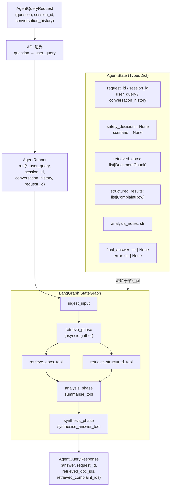

# 第 3 周 —— 从朴素 RAG 到 LangGraph 编排

你已经完成了第 2 周：在 Postgres 中建立了语料库，并且通过 `python -c`
单行命令手动调用了可用的 `RetrievalService`。这周，*agent 本体*要真正落地。

> **这是算力提示，不是警告。** \周第一次从真实图节点调用 LLM，所以轻薄本会明显感受到负载。本课程不再使用 Cursor。下面按成本效益给出几条路径；按你的环境选择即可——它们不会否定你已有的方案。
>
> 1. **Company Copilot（默认）。** 如果公司可用，申请 GitHub Copilot 或同类企业编码计划席位。
> 2. **Opencode Go（首月 $5，之后 $10）。** 低成本订阅。模型：DeepSeek V4、Mimo v2.5、Minimax 3。首月 5 美元，后续每月 10 美元。
> 3. **Opencode Zen（不要开启 Billing）。** 免费，无需配置计费。内置模型性能不错。
> 4. **DeepSeek 官方充值。** 直连 API，按量付费。
> 5. **本地 Ollama / mlx-community-optiq。** 免费且完全离线，但较慢。若 16 GB Mac 上默认模型发生切换，请在 `.env` 中改为 `OLLAMA_CHAT_MODEL=qwen3.5:4b`。
> 6. **你现有的 Coding Plan 订阅。** 如果你已经在用 Cline、Continue、Windsurf 或其他计划，也完全可行。
>
> 在第 3 周的 reconcile 说明里写明你选择的路径。完整策略见：`README.md` → “Provider posture”，`.spdd_specs/tasks/Task_0_Environment.md` → “Compute paths”。

## 本周你会拿到什么

- `.spdd_specs/tasks/Task_3_Orchestration.trainee.md` —— 你的周一简报。
- 周日会发布：`Task_3_Orchestration.md`（目标版本）。

## 本周引入的新内容

到周五，`POST /agent/query` 将返回有依据（grounded）的回答。

1. **`AgentState` TypedDict** —— 在 LangGraph 节点间流转。包含前向兼容字段（`safety_decision` 与 `scenario`），本周保持 `None`。后续任务会接入它们。
2. **四个工具节点** —— `retrieve_docs_tool`、`retrieve_structured_tool`、`summarise_tool`、`synthesise_answer_tool`。每个节点都是返回 *部分* `AgentState` 的 *纯函数*。
3. **`AgentRunner`** —— 仅关键字参数的 `run(*, user_query, session_id, conversation_history, request_id)`。HTTP 端点在边界把 API 字段（`question`）映射到运行时字段（`user_query`）。
4. **`scripts/smoke.starter.sh`** —— 三项检查：`/healthz`、`/readyz`、`/agent/query` happy path。请采用这个 starter 脚本。**本周不要**新建 smoke harness。

## 为什么这样设计

- **为什么 `AgentState` 用 TypedDict 而不是 Pydantic 模型？** 因为 LangGraph 的 reducer 机制与 TypedDict 更自然。Pydantic 仍然用于 API 边界上的 DTO——两者职责不同。
- **为什么 API 用 `question`，内部用 `user_query`？** 因为 API 字段按*用户心智模型*命名（“question”），内部字段按其在图中的*角色*命名（“user_query”）。在边界映射是有意的职责分离。
- **为什么 `safety_decision` 和 `scenario` 已经在 `AgentState` 上，但先保持 None？** 因为后加字段会引发 TypedDict 改动并连锁触发部分状态重构。前向兼容字段成本低，后向重构成本高。
- **为什么文档检索与投诉检索并发执行（`asyncio.gather`）？** 因为 Postgres 可以并行服务，时延收益很大。配合 `return_exceptions=True`，即使部分失败也仍可产出回答。

## 第 3 周常见坑

| 坑点 | 表现 | 修复方式 |
|---|---|---|
| 原地修改 `AgentState` | 节点里写 `state["foo"] = bar` 并返回 `state`。 | 节点应返回*部分* dict，由 reducer 合并。原地修改会破坏 LangGraph checkpoint。 |
| 在检索前就做综合 | 节点未检查 `state.get("retrieved_docs")` 就调用 `LLMService.complete()`。 | 图的边顺序就是契约。必须先检索，再综合。 |
| 未设置 `X-Request-Id` 响应头 | 日志能关联，但响应不能，后续排障成本高。 | 中间件要在每个响应（成功或错误）里都设置该头。 |
| API 直接返回原始 `AgentState` | 内部字段泄漏。 | 在边界映射为 `AgentQueryResponse` Pydantic 模型。 |

## 周三自检清单

- [ ] *Risks noticed* 至少列出 3 个真实风险：reducer 顺序错误、部分失败处理、以及下周会出现的会话历史膨胀（现在就开始思考——这是第 4 周核心）。
- [ ] *Trade-offs accepted* 覆盖：状态用 TypedDict vs Pydantic、串行 vs 并行检索、节点返回部分状态 vs 完整状态。
- [ ] *Class + flow diagram* 画出四个节点、`START → ingest_input → retrieve_phase → analysis_phase → synthesis_phase → END` 拓扑，以及 `AgentRunner`（引擎）与 `/agent/query`（API）边界。
- [ ] *Operations* 用编号列出，包含采用 `scripts/smoke.starter.sh` 这一步。

## 周日会揭示什么

目标画布会固定：仅关键字的 `AgentRunner.run` 签名、`AgentQueryRequest.question` 字段约束、`LLMProviderError` 的结构化 502 错误体，以及条件边（第 7 周接入 safety，第 8 周接入投诉信分支）的*形状*——这些边此时还不会触发，但拓扑必须预先就绪。

## 深入阅读（可选）

- 关于 LangGraph `StateGraph` 在部分返回下的 reducer 语义讲解——解释为何 `AgentState` 用 `TypedDict` 而非 Pydantic 模型。  
  [LangGraph Conceptual Guide: State & Reducers](https://langchain-ai.github.io/langgraph/concepts/low_level/)
- Anthropic 关于 “agentic patterns” 的文章——即使我们用的是 LangGraph 而非朴素 agentic 循环，也值得读。  
  [Anthropic: Building Effective Agents](https://www.anthropic.com/research/building-effective-agents)
- FastAPI `BackgroundTasks` 文档——后续接入反馈回写时会用到。  
  [FastAPI Background Tasks Documentation](https://fastapi.tiangolo.com/tutorial/background-tasks/)
- **并行执行底层机制：** 通过 `asyncio.gather` 并发检索文档和投诉，显著降低时延。建议掌握异步并发模式。  
  [Python `asyncio` Task Groups and `gather`](https://docs.python.org/3/library/asyncio-task.html)

## 开始做计划之前的问题

1. **前向兼容字段（`safety_decision` 与 `scenario`）是啥？**
   - `safety_decision`：预留给后续“安全判定/风控门控”节点，表示请求是否可继续、是否需要拒答/降级、以及原因。
   - `scenario`：预留给后续“场景分流”节点，表示当前请求属于哪类业务场景（例如普通问答、投诉信场景等）。
   - 这周先置为 `None`，目的是提前稳定 `AgentState` 结构，避免后续加字段引发连锁重构。

2. **`retrieve_structured_tool` 是啥？什么是 Structured？**
   - 它是“结构化检索节点”，面向有明确列结构的数据源（例如 `complaints` 表），通常按字段过滤/排序（如 `product`、`date_received`）。
   - `Structured` 指“有 schema 的表格型数据”，区别于文档段落这种非结构化文本（docs/chunks）。

3. **`summarise_tool` 在总结什么？**
   - 总结的是“检索阶段拿到的中间结果”，通常包括：
     - 非结构化文档命中（docs chunks）
     - 结构化数据命中（complaints rows）
   - 目标是把冗长检索结果压缩成后续 `synthesise_answer_tool` 易消费的关键信息，降低上下文噪声与 token 成本。

4. **`AgentRunner` 定义是啥？调用者是谁？**
   - 定义：编排执行入口，按图拓扑驱动各节点运行，签名是  
     `run(*, user_query, session_id, conversation_history, request_id)`。
   - 调用者：主要是 API 层（如 `/agent/query` handler）；后续也可被脚本、任务队列或测试代码调用。

5. **`question` → `user_query` 映射里，`user_query` 是啥？会直接查库吗？**
   - `user_query` 是运行时内部统一查询语义（图中各节点使用的字段），本质是“用户问题在引擎内的标准名称”。
   - 它不是“直接 SQL”。是否查库由后续检索节点决定：
     - `retrieve_docs_tool`：基于 embedding 相似度检索 docs/doc_embeddings
     - `retrieve_structured_tool`：按字段条件检索 complaints
   - 所以是“先映射命名，再由图节点按流程执行检索”，不是 API 层直接把 `question` 打到数据库。

6. **现在要不要按 `safety_decision` / `scenario` 写分支逻辑？**
   - **现在不要**。这两个字段这周只是“占位预留”，默认应为 `None`，不应该依赖它们来驱动当前主流程。
   - 当前周的主流程应当只依赖：
     - 用户输入 `question` / 内部 `user_query`
     - 检索结果是否成功返回
     - 后续是否能 synthesize 出答案
   - 正确做法是：把 `safety_decision` / `scenario` 作为未来扩展点保留，但**不要**因为它们还未定值而提前写分支判断。
   - 只有当后续任务明确了安全分类、场景分类、以及各自的取值空间时，才把它们接入图拓扑。

7. **`summarise_tool` 的返回会在 `synthesise_answer_tool` 里实际调用 LLM complete 吗？**
   - 是。`summarise_tool` 负责把检索结果压缩成更短、更结构化的中间表示；`synthesise_answer_tool` 再基于这个中间表示调用 LLM 生成最终回答。
   - 可以理解为：
     - `retrieve_*`：找证据
     - `summarise_tool`：整理证据
     - `synthesise_answer_tool`：基于证据写答案

8. **`user_query` 可以给个 example 吗？它是不是原始问题？**
   - 是，通常就是用户原始问题的内部标准名。
   - 例如：
     - API 收到 `question="Why was I charged a late fee?"`
     - 边界映射后，`AgentRunner.run(user_query="Why was I charged a late fee?", ...)`
   - 在这个周里，`user_query` 基本就是原始问题文本；后续如果需要做 query rewriting、分类、拆解，再在图内加新节点处理。

9. **`question` → `user_query` 的具体例子是什么？**
   - 例子如下：
     - `question = "我为什么被收了 late fee？"`
     - API 层把它传给 runner：`user_query = "我为什么被收了 late fee？"`
     - `retrieve_structured_tool` 可能拿它去找 `complaints` 里 `issue`/`company`/`narrative` 匹配的记录
     - `retrieve_docs_tool` 可能基于同一句话做 embedding，找相似文档段落
   - 所以 `question` 和 `user_query` 的区别不在“内容不同”，而在“角色不同”：前者是 API 输入名，后者是图内运行时字段名。

10. 关于run方法的参数逐个说明其用处以及在当前task是否是必要参数
   - `user_query`：用户原始问题在引擎内的标准输入，是整个图的核心触发条件。**必要**。
   - `session_id`：会话标识，用来把同一轮对话串起来，后续支持 history、记忆、审计或 checkpoint。**必要**。
   - `conversation_history`：历史对话上下文，供后续节点判断“这次问的是不是追问”、以及生成更贴合上下文的回答。**当前 task 需要保留接口，但可先为空或最小实现**。
   - `request_id`：请求追踪 ID，用于日志关联、排障和跨层链路追踪。**必要**。
   - 结论：这四个参数里，`user_query`、`session_id`、`request_id` 是当前主流程必须项；`conversation_history` 是为了接口稳定和后续扩展提前放进来的，当前可先按最小可用处理。
11. scenario这个可能的值有哪些，怎么用
   - **当前 task 不应该把 `scenario` 当成已定义好的可用分支值来依赖。** 它在这一周仍然应保持 `None`，不要据此写流程分支。
   - 它的作用是给后续“场景分流”预留一个位置：当未来明确了值域之后，图可以根据它选择不同的分支、不同的提示词、或不同的处理路径。
   - 例如，未来如果规格明确了某些场景，`scenario` 可能会用于区分：
     - 普通问答
     - 投诉相关问答
     - 安全拦截/拒答
   - 但这些只是**可能的方向**，不是本周的实现要求。当前计划里应写成：**预留字段，不接入逻辑，不假定具体值**。

12. 既然宪章要求任何错误都应该抛出来，为啥本章节又说complaints或者doc任何一个处理失败，仍然接着处理？

答：宪章的总体原则是关键错误应被抛出以避免静默失败。但本章在可用性与稳健性间做了权衡：对于并行检索任务，若仅一路（例如 complaints 或 docs）失败，则保留另一条成功路径并继续生成基于可用证据的回答，同时记录 warning、在日志与响应元数据中标注证据缺失，避免单点故障造成整个服务不可用；但若两路检索均失败（即没有任何证据可用），则必须抛出结构化错误（不允许以空上下文继续调用 LLM），从而防止幻觉和不负责任的回答。具体行为请参照“并行检索的失败处理”与 Safeguards 中的约束。

## 计划

### Compute Path 选择

**选择路径：OpenRouter（按量付费 / 免费模型）**

- `LLM_PROVIDER=openrouter`，通过 `OPENROUTER_API_KEY` 认证。
- **模型发现**：每次开始前运行 `python scripts/openrouter_free_smoke.py`，脚本自动拉取 OpenRouter 模型目录，按优先关键词（qwen/llama/gemma/mistral/deepseek）排序，smoke 验证后打印推荐的 `OPENROUTER_MODEL`、`EMBEDDING_MODEL`、`EMBEDDING_DIM`。
- **配置存储**：将模型结果写入 `.local-config/llm.env`（已 gitignore，不提交），项目 `start` 脚本或 `docker compose` 在启动时加载此文件覆盖默认值。
- **当前选定模型**（截至本周执行时）：
  - `OPENROUTER_MODEL=google/gemma-4-26b-a4b-it:free`（chat synthesis）
  - `EMBEDDING_MODEL=nvidia/llama-nemotron-embed-vl-1b-v2:free`（embedding）
  - `EMBEDDING_DIM=2048`（⚠️ 偏离宪章默认 768，已按宪章要求在同一次变更中重建 `doc_embeddings` 表）
- **模型替换**：若当前 free 模型不可用，重新运行 smoke 脚本，将新模型写入 `.local-config/llm.env` 并重启服务，无需改代码。
- Ollama 保留为备用 escape hatch，`OLLAMA_*` 变量仍在 `.env.example` 中维护。

---

### Risks

风险定义：在正确实现本章节关键需求 用户输入 -> 有根据的用户输出 的基础上，可能出现的导致没有办法拿到用户输出的问题即为风险

1. 用户输入过长导致的如超过数据库QUERY限制，LLM输入长度限制等问题
2. 假定风险：reducer 顺序错误 -- 按照Happy Path实现功能后，应该不存在此问题
3. 假定风险：部分失败处理 -- 未定义/未探讨部分任务失败后的处理方式，确实需要考虑，如LLM不可用或错误返回，数据库不可用
4. 假定风险：回话历史膨胀 -- 现阶段不考虑，因为现阶段，history给空
5. 并行服务，部分失败，也仍然返回结果，这里实际上和宪章有所违背，应该是直接报错

### Entities

1. 用户请求信息
   1. 问题信息 - 必要
   2. Session id - 必要
   3. Request Id - 必要
   4. Conversation History - 空（本周）
2. 节点状态
   1. safety_decision - 空（预留）
   2. scenario - 空（预留）
   3. structured_results - ComplaintRow 数组
   4. retrieved_docs - DocumentChunk 数组
   5. analysis_notes - summarise_tool 输出的中间摘要
   6. final_answer - LLM 综合回答结果



### Approach

#### Trade-offs

##### 状态用 TypedDict vs Pydantic

中间状态不需要有任何实体级别的校验，任何状态都是有效状态，只有reducer根据不同的状态选择不同的执行路径

结论：使用TypedDict

##### 串行 vs 并行检索

在数据库支持并行的前提条件下，两个查询间也没有互相依赖时，并行确实是更优解（不考虑数据库瓶颈）

结论：使用并行检索

##### 节点返回部分状态 vs 完整状态

其实关键在于职责的划分，不管怎样，下一个流程需要的是完整的节点状态，如果工具本身仅仅作为单纯的需要输入和输出来看，那么就需要在工具执行完成后，有新的步骤或者时角色执行完成state的组装任务。

如果将工具考虑为确实是可以更新状态角色，那么其可以只更新自己职责范围之内的信息，但是更新的逻辑或者说职责之类的信息隐藏在实现代码中，并不是一个很好的实现方案。

所以更加清晰的应该是，工具链中的每个工具仅考虑输入+输出，然后由紧接的reducer来进行流程控制和state组装

结论：节点返回部分状态 （这里认为的节点我认为仅仅是一个工具，和reducer分开的，如果一个节点的定义就是Agent下的唯一类型直接子成员，那节点应该返回完整状态，否则，应该还有reducer类型的成员来处理流程控制和信息组装，一个工具+reducer才被视为一个完整的节点）

#### 最终实现计划

1. UI提供会话框，用来接收用户输入问题，并生成session-id信息 （UI项目需要转换成Python实现）
2. API提供接口处理用户请求
3. AgentRunner.run处理请求
4. 初始化AgentState
5. 按照AgentState流程处理，即：用户问题 -> 初始化节点状态 -> 获取complaints (节点2，并行2-1) -> 获取docs（节点3，并行2-2） -> 组装信息（节点3） -> LLM调用（节点4），任何一步报错，则应该按照错误类型抛出正确的错误

##### 实现细节

**Step 1 — AgentState TypedDict**

新建 `src/financial_agent_api/agent/state.py`，定义 `AgentState`，字段完全对齐宪章：

```python
class AgentState(TypedDict):
    request_id: str
    session_id: str | None
    user_query: str
    conversation_history: list[dict]
    safety_decision: SafetyDecision | None   # 预留，本周始终为 None
    retrieved_docs: list[DocumentChunk]
    structured_results: list[ComplaintRow]
    scenario: Scenario | None                # 预留，本周始终为 None
    analysis_notes: str
    final_answer: str | None
    error: str | None
```

`SafetyDecision` 和 `Scenario` 引用宪章中的 Pydantic 模型（放在 `models/safety.py` 和 `models/scenario.py`，本周实际内容为空壳）。

**Step 2 — 四个工具节点（纯函数，返回部分 dict）**

新建 `src/financial_agent_api/agent/tools/`：

- `retrieve_docs_tool.py`：接收 `(state: AgentState, retrieval: RetrievalService) -> dict`，用 `state["user_query"]` 调用 `retrieval.retrieve_docs()`，返回 `{"retrieved_docs": [...]}` 或在失败时返回 `{"error": "...", "retrieved_docs": []}`。
- `retrieve_structured_tool.py`：同上，调用 `retrieval.retrieve_complaints()`，返回 `{"structured_results": [...]}` 或失败部分。
- `summarise_tool.py`：接收 state（已有 `retrieved_docs` + `structured_results`），用 `LLMService.complete()` 压缩为 `analysis_notes` 字符串，返回 `{"analysis_notes": "..."}`. 若 `retrieved_docs` 和 `structured_results` 均为空，直接返回 `{"analysis_notes": "No relevant context found."}`，**不调用 LLM**。
- `synthesise_answer_tool.py`：接收 state（已有 `analysis_notes`），用 `LLMService.complete()` 生成最终回答，返回 `{"final_answer": "..."}`. `LLMProviderError` 透传上抛（不吞掉）。

**Step 3 — LangGraph StateGraph（graph.py）**

新建 `src/financial_agent_api/agent/graph.py`：

```
START → ingest_input → retrieve_phase → analysis_phase → synthesis_phase → END
```

- `ingest_input` 节点：仅把 `user_query` 写入 state（初始化检查，不做 LLM 调用）。
- `retrieve_phase` 节点：用 `asyncio.gather(retrieve_docs_tool(...), retrieve_structured_tool(...), return_exceptions=True)` 并行执行，合并两个部分 dict 写入 state。若**两者均异常**则 raise；若仅一者异常则记 warning 并以空列表继续。
- `analysis_phase` 节点：调用 `summarise_tool`，写入 `analysis_notes`。
- `synthesis_phase` 节点：调用 `synthesise_answer_tool`，写入 `final_answer`。

节点间传递 `ServicesContainer` 通过 `functools.partial` 或闭包注入（**不**挂全局）。

**Step 4 — AgentRunner（runner.py）**

新建 `src/financial_agent_api/agent/runner.py`：

```python
class AgentRunner:
    def __init__(self, container: ServicesContainer) -> None: ...

    async def run(
        self,
        *,
        user_query: str,
        session_id: str | None,
        conversation_history: list[dict],
        request_id: str,
    ) -> AgentState: ...
```

内部初始化完整的 `AgentState`（含 `safety_decision=None`、`scenario=None`、空列表等），然后驱动 graph 运行，返回最终 state。

`AgentRunner` 在 `main.py` 的 `lifespan` 内构造，不加入 `ServicesContainer`（`ServicesContainer` 只持有基础服务），挂到 `app.state.runner`，路由通过 `request.app.state.runner` 获取。

**Step 5 — API DTO + 路由（routers/agent.py）**

新建 `src/financial_agent_api/models/agent.py`：

```python
class AgentQueryRequest(BaseModel):
    question: str                          # 用户心智模型字段名
    session_id: str | None = None
    conversation_history: list[dict] = []

class AgentQueryResponse(BaseModel):
    answer: str
    request_id: str
    retrieved_doc_ids: list[int]
    retrieved_complaint_ids: list[str]
```

新建 `src/financial_agent_api/routers/agent.py`：

- `POST /agent/query`：`request_id` 通过 `get_request_id()`（现有 context var，由中间件 `bind_request_id` 注入）读取，**不从 `request.state` 读**。把 `request.question` 映射为 `user_query`，调用 `AgentRunner.run()`，把 `AgentState` 映射为 `AgentQueryResponse`，异常时：
  - `LLMProviderError` → HTTP 502，body 包含 `{"error_code": "llm_provider_error", "message": ..., "request_id": ...}`
  - 其他未预期异常 → HTTP 500，相同结构

在 `main.py` 中：在 `lifespan` 内构造 `AgentRunner(container)`，挂到 `app.state.runner`，再 `include_router(agent_router)`。路由通过 `request.app.state.runner` 取得实例（**不**注入 `ServicesContainer` 本身到路由，保持 `AgentRunner` 作为唯一编排入口）。

**Step 6 — smoke.starter.sh**

在项目根 `scripts/smoke.starter.sh`（引用宪章要求的 starter 脚本位置）：

```bash
#!/usr/bin/env bash
set -euo pipefail
BASE_URL="${BASE_URL:-http://financial-agent-api.localhost.com}"

# 1. healthz
curl -sf "$BASE_URL/healthz"

# 2. readyz
curl -sf "$BASE_URL/readyz"

# 3. /agent/query happy path
curl -sf -X POST "$BASE_URL/agent/query" \
  -H "Content-Type: application/json" \
  -d '{"question": "What is an overdraft fee?"}' | python3 -m json.tool
```

**Step 7 — 单元测试**

- `tests/test_tools.py`：用 stub `RetrievalService` / `LLMService` 验证四个工具节点的输入/输出契约。
- `tests/test_graph.py`：用 stub container 验证 graph 拓扑（节点按正确顺序执行，`final_answer` 非空）。
- `tests/test_agent_endpoint.py`：用 `httpx.AsyncClient` + `app` 测试 `/agent/query` happy path 和 LLM 502 错误路径，验证 `X-Request-Id` 响应头存在。

### Structure

本周新增/修改的文件（格式与宪章 Structure 对齐）：

```text
codebases/financial-agent-api/
├── src/
│   └── financial_agent_api/
│       ├── agent/                                # ← 本周新增
│       │   ├── __init__.py
│       │   ├── state.py                          # AgentState TypedDict（含预留字段）
│       │   ├── runner.py                         # AgentRunner.run(*, ...)
│       │   ├── graph.py                          # LangGraph StateGraph 拓扑
│       │   └── tools/
│       │       ├── __init__.py
│       │       ├── retrieve_docs_tool.py         # 文档检索节点
│       │       ├── retrieve_structured_tool.py   # 投诉结构化检索节点
│       │       ├── summarise_tool.py             # 检索结果压缩节点
│       │       └── synthesise_answer_tool.py     # LLM 综合回答节点
│       ├── models/
│       │   ├── retrieval.py                      # 已有：DocumentChunk, ComplaintRow
│       │   ├── agent.py                          # ← 本周新增：AgentQueryRequest, AgentQueryResponse
│       │   ├── safety.py                         # ← 本周新增：SafetyDecision（空壳，预留）
│       │   └── scenario.py                       # ← 本周新增：Scenario（空壳，预留）
│       ├── routers/
│       │   ├── __init__.py                       # ← 本周新增
│       │   └── agent.py                          # ← 本周新增：POST /agent/query
│       └── main.py                               # 修改：include_router(agent_router)
└── tests/
    ├── test_tools.py                             # ← 本周新增
    ├── test_graph.py                             # ← 本周新增
    └── test_agent_endpoint.py                   # ← 本周新增

scripts/
└── smoke.starter.sh                             # ← 本周新增（项目根）
```

**宪章同步更新：** 宪章 `## Structure → Repository layout` 中 `financial-agent-api` 小节，添加上述新文件路径。

### Operations

验证本周功能完整性的必要操作（按执行顺序编号）：

1. **依赖安装**：在 `codebases/financial-agent-api/` 目录下运行 `uv sync`，确认 `langgraph` 已加入 `pyproject.toml` 并锁定。
2. **数据库就绪**：运行 `docker compose up financial-agent-db -d`，等待 healthcheck 通过。确认 `complaints` 和 `docs`/`doc_embeddings` 表已存在且有数据（Week 2 产出）。
3. **启动 API**：运行 `docker compose up financial-agent-api` 或 `scripts/start_api.sh`，确认启动日志无报错。
4. **Smoke 测试**：执行 `bash scripts/smoke.starter.sh`，三项检查全部通过（`/healthz`、`/readyz`、`/agent/query` happy path 返回 `answer` 字段非空）。
5. **单元测试**：在 `codebases/financial-agent-api/` 目录下运行 `uv run pytest tests/ -v`，所有测试通过（含 `test_tools.py`、`test_graph.py`、`test_agent_endpoint.py`）。
6. **响应头校验**：对 `POST /agent/query` 的响应确认 `X-Request-Id` 响应头存在（可用 `curl -i` 或在 `test_agent_endpoint.py` 中断言）。
7. **LLM 错误路径**：通过 stub 或模拟，触发 `LLMProviderError`，确认 `/agent/query` 返回 HTTP 502，且 body 包含 `error_code`、`message`、`request_id` 三个字段。

### Norms

1. **工具节点是纯函数**：每个 `*_tool` 函数签名为 `(state: AgentState, <service>) -> dict`，只依赖入参，不修改 state，不持有全局状态。返回的 dict 仅包含本工具负责的字段。
2. **AgentRunner.run 必须全关键字参数**：四个参数 `user_query`、`session_id`、`conversation_history`、`request_id` 全部为 keyword-only（`*` 分隔符之后），防止位置错用。
3. **API 边界映射**：`/agent/query` handler 中把 `AgentQueryRequest.question` 显式映射为 `user_query`，不允许两个名字在同一层级混用。
4. **响应不暴露内部状态**：handler 只允许把 `AgentState` 映射为 `AgentQueryResponse` 后返回，原始 state dict 禁止直接序列化为响应 body。
5. **X-Request-Id 每次响应都设置**：现有中间件已在成功响应上设置，本周的错误路径（502/500）同样必须设置该头，由 exception handler 保证。
6. **LLMProviderError → HTTP 502**：在 `routers/agent.py` 注册 exception handler，捕获 `LLMProviderError`，返回 `{"error_code": "llm_provider_error", "message": ..., "request_id": ...}` + status 502。其他未预期异常 → 500。
7. **并行检索的失败处理**：两个检索任务均失败时，必须 raise（不允许以空列表静默返回答案）；仅一者失败时，记录 warning 日志，另一路结果照常使用——即"部分失败可继续"，但"全失败必须报错"。
8. **prompt 模板位置**：`summarise_tool` 和 `synthesise_answer_tool` 中调用 LLM 所用的 prompt 内容，本周可内联 string（因模板服务在 Week 4 引入），但要为后续迁移到 `.j2` 预留注释标记。
9. **测试 mock 边界**：单元测试 mock 在网络/DB 边界（`LLMHTTPClient`、`Session`），不 mock 更深的业务逻辑。fixture 放在 `tests/fixtures/` 目录。

### Safeguards

1. **内部字段不得泄漏**：`AgentState` 中的 `safety_decision`、`scenario`、`error`、`analysis_notes` 等内部字段禁止出现在 `AgentQueryResponse` 里。若无意中把整个 state 序列化返回，会暴露未来安全策略的内部判定结果，是信息泄漏风险。
2. **LLM 返回值必须经过类型检查**：`synthesise_answer_tool` 和 `summarise_tool` 拿到 `LLMService.complete()` 的结果后，必须验证它是非空字符串，不能直接写入 state 后假定后续消费者会处理 None。
3. **request_id 不得为空**：`AgentRunner.run` 的 `request_id` 为必填关键字参数，不设默认值，强制调用方在 API 层生成并传入，确保全链路可追踪。
4. **全失败不静默**：若两路并行检索（docs + complaints）均异常，不允许以空上下文继续调用 LLM 生成回答（"幻觉风险"），必须抛出结构化错误。
5. **超长用户输入的边界**：`AgentQueryRequest.question` 应设置 `max_length`（如 2000 字符），避免超长输入打穿 embedding 和 LLM 上下文限制；Pydantic validator 层拒绝，返回 HTTP 422。