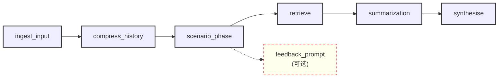

# 第4周 — 提示与对话压缩（上下文工程，阶段 1）

第3周已交付：可用的 `POST /agent/query`，包含四节点图。但每个提示都作为难以维护的字符串埋在一个 Python
工具里。本周要修复这个问题——同时学习行业中称作 **上下文工程（Context Engineering）** 的第一个术语。

> **提醒。** 这是教学大纲中两次上下文工程注入的第一次。阶段一（本周）较小且偏战术：添加一个 LangGraph 节点，用于压缩冗长的对话历史。阶段二（第
> 8 周子任务 D）是成熟的基于意图的版本，会闭合课程中最大的循环。本周不要强行自学阶段二的所有术语——等到阶段二到位后，学习回报会更明显。

> **本周的 Scenario 设计原则。** `scenario_phase` 的目标不是“尽量猜一个场景”，而是**先判断 product_type 是否足以支撑 complaints 查询**。只要 `product_type`
> 不明确，就不要去查 complaints，避免把非产品相关的投诉混进后续检索。只有在 complaints 数据源本身没有可用映射时，才允许 `scenario=None` 作为静默兜底；其他所有场景识别失败，都应走 feedback，
> 让用户补充到可以得到正确 `Scenario` 的程度。

## 本周交付

- `.spdd_specs/tasks/Task_4_Prompts.trainee.md` — 你的周一简报。
- 周日目标稿：`Task_4_Prompts.md`。

## 本周引入的内容

按优先级顺序说明三件事：

1. 在 `app/core/prompts/*.j2` 中使用有版本的提示模板，通过单一的 `PromptService` 加载，并采用 strict-undefined 的
   Jinja。替换第 3 周中的内联字符串。
2. **Scenario 提取**——新增在检索之前运行的节点 `scenario_phase`，它会提取一个 `Scenario`
   JSON（product_type、issue_type、confidence）。提取结果用于提示渲染与检索过滤；其中 `product_type`
   是决定是否进入 complaints 查询的关键字段，`product_type` 不明确时应跳过 complaints 查询。只有在 complaints 数据源本身没有可用映射时，
   才允许 `scenario=None` 作为静默兜底；其余失败路径应进入 feedback。docs 向量索引仍然保持并行查询，以保证覆盖与鲁棒性（详见“检索决策”）。
3. **阶段一对话压缩（conversation compression）**——实现一个 `compress_history` 帮助函数，在 `ingest_input` 阶段当
   `len(conversation_history) > N` 时调用。它使用 `compress_history.j2` 模板调用小型
   LLM，把较早的消息折叠成单个摘要字符串，保留最后几次交互的逐字内容，然后把压缩后的列表写回
   `AgentState.conversation_history`。

本周还定义了第四个概念（`SafetyDecision` 的 Pydantic 形状），但**尚未在图中强制执行**（第 7 周会强制执行）。

## 为什么要这样做

### 关于提示（容易的部分）

- **为什么用 strict-undefined 的 Jinja？** 因为缺失的变量应当成为构建错误，而不是静默的空字符串。这可以在进入生产前捕获模板/数据形状的漂移。
- **为什么把提示模板版本化放在 `app/core/prompts/`？** 因为在第 5 周，评估流水线会把提示作为回归测试对象，就像单元测试回归代码一样。未被跟踪的提示无法回归测试。
- **为什么 `product_type` 不明确时要跳过 complaints？** 因为 complaints 检索的价值在于缩小到相关产品范围；如果没有 product 约束，查到的就是大量非产品相关投诉，会削弱
  `scenario_phase` 的意义，并让后续分析更噪声化。
- **为什么只在 complaints 映射为空时允许 `scenario=None`？** 因为这表示数据源本身无法支持场景提取，是基础设施层面的兜底；除此之外，场景识别失败应该通过 feedback
  把用户拉回到可判断状态，而不是默默产出一个空场景。

### 关于 `compress_history`（新的部分——教授上下文工程的核心）

- **它解决了什么问题？** 对话历史按轮次线性增长。到第 10 轮时，LLM 要读取前 9 轮的上下文，造成 token
  成本膨胀、提示缓存命中率下降，并超出模型的有效注意力范围。这是把工作代理从原型推向生产不可承受的成本增长的根源。
- **为什么阈值取 5？** 一个实用的启发式。前约 5 轮通常落在模型的连贯注意力窗口内；第 6 轮开始出现可测的退化。把 5 视为可调参数（放到
  `Settings`）。
- **为什么保留最后两轮逐字？** 因为最近的上下文（上一问与其回答）信息密度最高，推理依赖它。对最后一轮做摘要会破坏基于事实的后续回答。
- **为什么用小型/运维级别的 LLM 做摘要？** 摘要本身也是一次 LLM 调用。用 `gemma3:27b` 为 `gemma3:27b` 做摘要会把成本翻倍。运维模型（如
  `qwen3.5:4b`）速度快且足够把 5 条消息压缩到 ~200 token 的摘要。
- **为什么在合成提示渲染前先压缩？** 因为提示模板会针对 `state["conversation_history"]` 渲染。先压缩再渲染，有利于提示缓存稳定性——第
  8 周会再次精确讨论这一点。

常见问题："我们能缓存 system-prompt 前缀然后跳过压缩吗？" 答：缓存与压缩是互补的，而非竞争。第 8 周子任务 D
会介绍基于意图的缓存组与成本节省机制；若本周先交付 `compress_history`，两者更易组合。

## 第 4 周常见陷阱

| 陷阱                        | 表现                                    | 修复                                                     |
|---------------------------|---------------------------------------|--------------------------------------------------------|
| 压缩了最后一轮                   | 摘要吞掉了“我刚在加州买了房子”之类的信息，导致下一次回答不知道司法辖区。 | 保留最后两轮逐字。摘要只覆盖更早的消息。                                   |
| 使用合成模型来做压缩                | 成本高且慢。                                | 在 `Settings` 中使用运维模型。                                  |
| 每轮都压缩                     | 短对话被压缩成无用的一行摘要（例如“用户说了你好”）。           | 阈值设为 5；低于阈值不执行压缩。                                      |
| 忘记对新模板启用 strict-undefined | 缺失变量（如 `messages`）时渲染为空字符串。           | 章程（constitution）将 `StrictUndefined` 设为所有 Jinja 模板的默认值。 |
| 工具中仍保留内联提示字符串             | 测试文件或工具保留了提示副本，造成分叉。                  | 章程规范：`app/core/prompts/` 是提示注册表。删除其他位置的副本。             |

## 周三自查（Wednesday self-check）

- [ ] *发现的风险*：Jinja 未定义错误、Scenario 形状的 JSON 解析失败、以及 `compress_history` 所处理的对话历史暴涨问题。
- [ ] *接受的权衡*：Jinja vs f-strings vs PEP 750 模板、在提示中放 schema vs 使用 JSON-mode、重试预算 vs 延迟，以及阈值压缩
  vs 始终压缩 vs 从不压缩。
- [ ] *类图*：展示 `PromptService → templates`，把 `compress_history` 作为 `ingest_input` 的独立帮助函数，并列出带有有界重试的
  Scenario 提取工具。
- [ ] *运维事项*：将压缩步骤作为独立的运维步骤编号（目标画布在周日会明确它的放置位置）。

## 周日将揭示的内容

目标画布会固定：

- 四个提示模板的名称及其输入变量。
- `Scenario` 与 `SafetyDecision` 的 Pydantic 形状（位于 `app/core/safety_policy.py`）。
- `ScenarioExtractionTool`，带一次有界重试，并在第二次失败后触发 feedback，把用户带回到可采信 Scenario 的路径。重试只应覆盖可恢复错误（例如 `LLMOutputValidationError`、网络错误、`5xx`），`LLMProviderError` 的 `400/429` 不应继续重试同一个请求。
- `compress_history` 帮助函数的签名、阈值与逐字尾部策略。

请把你周五的工作与周日目标做 diff，并在周一前提交对齐的 PR。

## 深入阅读（可选）

- Anthropic 关于 context window engineering 的文章：
  https://docs.anthropic.com/en/docs/build-with-claude/prompt-engineering
- 关于 token 计数（`tiktoken` 或 Anthropic tokenizer endpoint）：
  https://github.com/openai/tiktoken
- LangGraph memory 与 checkpointing 教程：
  https://langchain-ai.github.io/langgraph/concepts/memory/
- Jinja Strict-Undefined 文档：
  https://jinja.palletsprojects.com/en/3.1.x/api/#jinja2.StrictUndefined

## 规格决策记录（已对齐）

本节记录了规格评审中的四个关键风险与决策。详细实现指南见 `Task_4_Implementation_Guide.zh.md`。

### 1️⃣ Risks

#### Q1: StrictUndefined 在生产中碰到 template-data 不匹配时直接 500，你接受吗？

**决策：分情况处理**

- **来自固定环保参数的不匹配**（如环变量、数据库连接配置）
    - 应在 CI 测试阶段提前发现
    - 若未发现，直接 500 是可接受的（用户界面提示错误信息）

- **来自用户输入的不匹配**（如场景提取结果格式异常）
    - 直接 500 会损害用户体验
    - 改为：返回反馈提示（由 `feedback_prompt.j2` LLM生成），让用户重新提供信息
    - 不中断后续节点，给用户有尊严的恢复路径

---

#### Q2: Scenario JSON 解析失败用默认值还是抛异常？

**决策：反馈重新输入，不用默认值**

- 原因分析：
    - Schema in Prompt 模式：LLM 无法保证格式 → JSON 解析失败
    - JSON Mode 模式：LLM 返回无效 JSON → 解析失败
    - 无论哪种，默认值会导致下游节点行为不可控

- 处理流程：
    1. 第一次尝试 + 有界重试（1次）
    2. 重试仍失败 → 进入 feedback 流程
    3. 使用 `feedback_prompt.j2` 生成面向用户的澄清提示
    4. 返回给用户，不继续 graph 流程
    5. 日志记录失败原因、重试次数，便于后续分析

---

#### Q3: compress 阈值设 5 的依据是什么？

**决策：基准值设 5，可配置优化**

- **基准值的依据：**
    - 前 ~5 轮对话通常在模型的连贯注意力窗口内
    - 第 6 轮开始出现可测的性能退化
    - 成本收益平衡：5 是最小化成本的起点

- **后续优化方向（基于 Token 消费）：**
    - 允许用户在合理范围内调整保留历史长度
    - 防护：单次历史不超过配置上限（如 10MB），防止系统异常

- **监控指标：**
    - 每轮压缩的 token 节省比
    - 压缩质量（confidence）与最终回答满意度的相关性
    - 据此调整阈值

**配置对应：** `COMPRESS_HISTORY_THRESHOLD=5`、`COMPRESS_KEEP_LAST_N_TURNS=2`、`CONVERSATION_HISTORY_MAX_SIZE_MB=10.0`

---

#### Q4: 如果 ops 模型压缩生成的中文 summary 有歧义怎么办？

**决策：JSON Mode + confidence 检查 + 渐进式重试 + 日志追踪**

- **第一步：启用 JSON Mode**
    - 调用 ops 模型时使用 JSON Mode，确保能解析 `confidence` 字段
    - 前提：验证所选 ops 模型支持 JSON Mode

- **第二步：质量检查**
    - 拿到压缩结果后检查：`confidence >= 阈值（0.75）`
    - 不达标则进入重试流程

- **第三步：渐进式重试**
  ```
  压缩失败或低质量
  ├─ 重试1（ops模型再试一次）
  │  ├─ 成功且达标 → 使用此结果
  │  └─ 仍失败 → 进入fallback
  │
  └─ fallback：使用主模型压缩一次
     ├─ 成功 → 使用此结果
     └─ 失败或仍低质 → 跳过压缩，仅保留最后N轮
  ```

- **第四步：日志与反馈**
    - 记录：总压缩请求数、成功数、达标数、使用模型、最终状态
    - 定期分析：是否需要调整信心度阈值或重试策略
    - 关联用户反馈：如发现回答满意度与压缩质量有相关性，计入阈值设置逻辑

**配置对应：** `COMPRESS_MODEL=qwen:3.5-4b`、`COMPRESS_CONFIDENCE_MIN=0.75`、`COMPRESS_RETRY_LIMIT=2`

---

### 2️⃣ Class + Flow Diagram



**节点说明：**

| 节点                      | 用途                          | 模板                       | 输出                                       |
|-------------------------|-----------------------------|--------------------------|------------------------------------------|
| **ingest_input**        | 校验并标准化用户输入                  | -                        | 标准化 query                                |
| **compress_history**    | 压缩旧消息，保留最后2轮                | `compress_history.j2`    | `{summary_text, confidence}`             |
| **scenario_phase**      | 提取用户意图与过滤条件                 | `scenario_extraction.j2` | `{product_type, issue_type, confidence}` |
| **retrieve**            | 查询 complaints（过滤）+ docs（全查） | -                        | `{retrieved_complaints, retrieved_docs}` |
| **summarization**       | 综合上文、检索结果生成摘要               | `summarization.j2`       | 中间摘要文本                                   |
| **synthesise**          | 基于摘要生成最终回复                  | `synthesise.j2`          | 用户回复                                     |
| **feedback_prompt**（可选） | Scenario低置信度或缺关键信息时，生成澄清提示  | `feedback_prompt.j2`     | 用户澄清提示                                   |

**关键决策：**

- `scenario_phase` 失败 → 触发 feedback，不继续 retrieve
- 不绘制 `safety_phase`（Week 7 才引入强制执行）

---

### 3️⃣ Trade-offs

#### Jinja vs f-string vs PEP 750 template literal

**需求清单：**

1. 支持基本的参数+模板渲染
2. 支持必填字段验证 + 缺失时报错
3. 支持外部文件模板
4. 稳定性高
5. 支持编译阶段验证

**方案对比：**

| 方案                 | 优点                                | 缺点            | 适用场景      |
|--------------------|-----------------------------------|---------------|-----------|
| **A. Jinja2** ⭐推荐  | 成熟生态、StrictUndefined、支持文件+宏、编译期校验 | 需引入依赖、渲染性能需关注 | 生产级提示系统   |
| **B. f-strings**   | 无依赖、语法简单                          | 无运行时校验、难版本控制  | PoC/临时片段  |
| **C. PEP 750 字面量** | 定制性、原生语义                          | 无成熟工具链、需自研    | 特殊需求+投入充足 |

**推荐做法（总结）：**

- ✅ 采用 **Jinja2** + **StrictUndefined**，所有模板放在 `app/core/prompts/` 版本化
- ✅ 实现 `PromptService` 统一加载/渲染，支持编译期校验脚本
- ✅ 创建 `manifest.yaml` 声明所有模板变量，驱动文档和自动化测试

**最终决议：方案 A（Jinja2）**

---

## 实现指南

### Trade-offs

#### schema-in-prompt 描述 vs JSON mode 参数

这点其实在之前的章节中已经确认过了，采取JSON mode，实现确定性的错误，避免不确定的正确

#### compress 阈值定 5 还是 10

目前选择5即可，这个不论是5还是10，其实差别不大，真正哪个合适要等统计数据验证。目前关键是要支持环境变量配置和相关日志支持

#### ops 模型选择标准（快 vs 准 vs 便宜？三次每次都要好）

同理，模型的产出效果有待实际数据验证，在现阶段仅考虑免费模型的情况下，以准这个原则优先

#### 失败时默认 scenario vs raise

不要默认 scenario，而是在失败时（有限的重试次数之后）抛出异常或返回错误信息，让用户明确知道需要提供哪些信息。

### Operations

#### 模板文件要先写（编译期检查）

1. 模板文件参见选用的模板渲染支持工具，要求能够自动在编译期间检测或者是手动触发在启动阶段检测

#### PromptService 要先于所有工具节点初始化

关于这一点，我不是很理解原因，其实只要确保，某些需要渲染得到prompt的方法执行时，能够调用PromptService渲染得到prompt即可。

如果因为选择的技术本身的原因，比如首次渲染速度很慢这种，可以看看是否支持配置热启动，或者在启动阶段手动热加载

#### `scenario_phase` 插入在 `retrieve` 之前但不是取代 ingest_input

这个是当然得，因为目前ingest_input负责的是用户输入的基本校验，在校验通过之后，才能够进入后续节点

#### `compress_history` 的阈值写在 Settings 里

这个当然，因为这个值后面是一定需要根据实际效果进行更新的

## 问题

AI 回答下面的每个问题，由用户审批

1) 从现有节点和新加节点的角度思考，具体哪些 Prompt 需要添加，以及每个 Prompt 模板所需参数（是否必填，作用）

- scenario_extraction.j2（必填）
    - inputs: messages（最近若干轮消息，required）、allowed_product_issue_map（required，非空对象，包含 product -> issues
      的映射关系，例如 `{"Credit": ["Getting a credit card", "xxxx"]}`）
    - 产出: Scenario JSON（product_type, issue_type, confidence）
    - 说明：prompt 要求 LLM 可选返回 product_type / issue_type（若能确定），并返回 confidence；本周实现仅保留这三个字段，不额外要求审计片段。
        - allowed_product_issue_map 用处与约束：
            - 用处：在渲染 extraction prompt 时，向 LLM 同时提供允许的 product 值以及每个 product 下允许的 issue 值，使 LLM
              的 `product_type` 与 `issue_type` 输出都受限于 complaints 数据库中真实存在的范围。
            - 约束：`allowed_product_issue_map` 必须来自 complaints 数据源，且对象至少包含一个 product；每个 product 对应的
              issue 列表也应非空。当该对象为空或未提供时，上一阶段应跳过 scenario_extraction，且本周允许 `scenario=None`
              作为静默兜底。
        - product_type 生成规则：
            - product_type（在 Scenario JSON 中）应从 `allowed_product_issue_map` 的 key 中选取，或者返回 `null`。
            - 当 LLM 高置信度判断当前用户问题不对应任何 allowed product 时，应返回 `product_type = null`，并给出高
              `confidence`。这表示“当前 complaints 数据中没有可用于参考的目标 product”，而不是“模型无法判断”。
            - 后端在采信该结果后，若 `product_type = null`，则应跳过 Retrieve Complaints 阶段，不再打开 complaints 查询。
            - 服务端仅做成员校验：非空 `product_type` 必须属于 `allowed_product_issue_map` 的 key；若不属于，则该结果无效。
        - issue_type 用处与生成规则：
            - 用处：用于在查询 complaints 时，进一步过滤对应 product 下的 `issue` 字段，从而缩小候选 complaint 范围。
            - 生成规则：当 `product_type` 已确定时，`issue_type` 应从该 `product_type` 在 `allowed_product_issue_map` 中对应的
              issue 列表里选取，或者返回 `null`。若 LLM 高置信度判断该 product 下没有合适的 issue 匹配，也可以返回
              `issue_type = null`，并保留高 `confidence`。
            - 服务端仅做成员校验：非空 `issue_type` 必须属于 `allowed_product_issue_map[product_type]`
              的允许值范围；若不属于，则该结果无效。
        - confidence 用处与使用规则：
            - 用处：表示本次 Scenario 提取结果的可信分数，用于决定是否直接采用本次提取结果，还是触发 feedback 流程。
            - 使用规则：后端先判断 `confidence` 是否达到阈值。若达到阈值，则采信本次提取结论；此时若 `product_type = null`
              ，表示应跳过 Retrieve Complaints。若 `product_type` 非空，则再继续使用 `issue_type` 过滤 complaints。
            - 失败处理：若 `confidence` 低于阈值，或字段成员校验失败，则不应把该 Scenario
              当作确定结果使用；应进入有界重试，若仍失败则触发 feedback，让用户补充信息直至能够得到可采信的 Scenario。
    - 用途: 用于构建检索过滤条件与选择模板变量，但检索阶段默认同时查询结构化 complaints 与 docs 向量数据源，以确保覆盖与稳健性。

    - AI Review: 本回答对 scenario_extraction 的输入/输出和成员校验规则说明充分、可执行。建议补充：1) 给出一组示例输入/输出
      JSON 以便开发与测试；2) 明确当 `allowed_product_issue_map` 为空或缺失时的具体系统行为示例；3) 增加边界和错误处理的单元测试用例说明。

- compress_history.j2（必填）
    - inputs:
        - messages_to_compress（required）：需要被压缩的旧消息列表；这里只包含“将被折叠”的历史消息，不包含最终要原样保留的最近消息。
        - 补充说明：是否触发压缩、保留多少尾部原始消息、使用什么模型，以及如何校验 `confidence`，都不由 `compress_history.j2`
          决定，而是在模板外由帮助函数与运行时配置处理。
    - 产出: {summary_text, confidence: float}
        - `summary_text` 仅包含对 `messages_to_compress` 的压缩结果，不包含原样保留的尾部消息。
        - 最终写回 `conversation_history` 时，应由模板外的帮助函数完成拼接：`[压缩摘要] + [最近保留的原始消息]`。
        - 模板内固定要求：保持输入消息的主要语言，不要无必要翻译术语；只保留后续推理需要的事实，不新增信息，尽量简洁。
    - 用途: 把早期消息折叠为摘要，同时保留尾部逐字消息，以降低上下文长度但不丢失最近交互信息。

    - AI Review: compress_history
      的模板与输出定义清晰，强调了模板外逻辑（如尾部保留与触发条件）是正确的工程做法。建议补充：1) 模板示例（输入 messages
      列表与预期 summary JSON）；2) 明确增量压缩 vs 全量压缩的默认行为与回退路径；3) 在实现中记录压缩版本/来源以便溯源。

- summarization.j2（必填）
    - inputs: user_query（required）、conversation_history（required）、retrieved_complaints（可选）、retrieved_docs（可选）
    - 产出: `summarization`（供 synthesise 节点使用的中间总结）。

    - AI Review: summarization 的输入与产出描述到位，适合作为中间层。建议补充示例：提供一段典型 conversation_history
      与检索结果示例，及期望的 summarization 文本，以便评估模型输出质量和测试用例编写。

- synthesise.j2（必填）
    - inputs: user_query（required）、summarization（required）
    - 产出: 最终回复。

（可扩展）feedback_prompt.j2：用于生成指示用户补充信息或显式错误消息。

- inputs: user_query（required）、failure_reason（required）、scenario（可选）、guidance（可选）
- 产出: `feedback_message`

- AI Review: feedback_prompt 的存在是必要且合理的。建议：1) 明确反馈的语气/风格（示例：友好、简洁、引导式）；2) 提供至少 2
  个模板示例（缺失字段提示、低置信度澄清）；3) 在实现中记录用户是否按提示补充以评估模板效果。


2) 建议新增的环境变量（名称 | 必填 | 说明 | 示例默认）

- COMPRESS_THRESHOLD | 可选 | 达到此轮次时触发压缩 | 5
- COMPRESS_OPS_MODEL | 可选 | 用于压缩的运维/轻量模型标识 | qwen3.5:4b
- COMPRESS_CONFIDENCE_THRESHOLD | 可选 | 压缩产出可接受的最低 confidence | 0.70


3) 历史记录传参策略（建议并说明权衡）

- 结论：客户端默认只传当前轮次的 `query` 和 `session_id`；历史对话由后端自动加载，客户端上传的 `conversation_history` 仅作为兼容字段接收，但不作为真相源，也不应覆盖服务端历史。
- 会话标识：统一使用 `session_id`。首轮请求允许不带 `session_id`，由后端创建并返回；后续轮次由客户端带回该 `session_id`。
- 历史存储：历史由后端数据库持有，而不是仅保存在内存中，以支持压缩、检索、调试与追踪。
- 历史加载：每次请求先加载该 `session_id` 的完整历史，再统一交给 `compress_history` 处理；不建议先做客户端侧截断。
- 并发策略：同一个 `session_id` 的 query 应串行处理，避免对话顺序错乱、压缩结果漂移或检索上下文不一致。
- 写回策略：用户消息进入时先写入 user message；最终回复生成后再补写 assistant message。这样即使中途失败，也能保留用户本轮输入事实。
- 取舍说明：该方案牺牲了一部分客户端灵活性，但换来了历史来源唯一、压缩逻辑统一、接口更简单，以及更稳定的后续演进空间。


4) 压缩历史对话的模型选择、质量判断与 on‑boarding 需求

- 选择原则：优先“快速、低成本且支持 JSON Mode 的运维模型”，确保稳定输出机器可解析的 `{summary, confidence}`。
- 评估维度：延迟、成本、JSON 可解析稳定性、摘要保真度（是否保留后续推理所需事实）。
- on‑boarding 步骤：收集代表性对话集 → 离线评估压缩保真度 → 设置信心阈值 → 在预生产做 A/B 测试（指标：用户满意度、下游检索命中率、token
  消耗、延迟）。
- 运行时策略：先进行压缩并检查 `confidence`；若低于阈值，则额外重试一次；若仍不达标，则放弃压缩并记录日志以便后续分析。
- 说明：本问题只讨论模型选择与质量判断；压缩状态是否采用增量维护，见问题 6。

5) `allowed_product_issue_map` 的来源、刷新与存储策略

- 来源：`allowed_product_issue_map` 应直接来源于 complaints 数据，而不是手写枚举。具体做法是从 complaints 中提取去重后的
  `product`，以及每个 `product` 下去重后的 `issue`，构造成 `product -> issues[]` 的映射对象。
- 刷新时机：不应在每次请求或普通项目启动时临时现算；应在 complaints 入库/刷新完成后立即同步刷新。结合当前项目实际，最合适的位置就是
  Docker service 启动时执行的 complaints 入库步骤完成之后。
- 存储位置：mapping 不应只存在内存或临时文件中，建议作为 complaints 的派生数据一并落库。
- 存储形式：推荐使用一张专用数据库表，按行保存合法的 `product` / `issue` 组合；运行时再从该表读取并组装成
  `allowed_product_issue_map`。相比直接存整块 JSON，这种方式更容易调试、校验与后续扩展。
- 运行时使用：API 在需要执行 `scenario_extraction` 时，从该派生表读取并组装 `allowed_product_issue_map`；若该映射不存在或为空，则跳过
  `scenario_extraction`，继续执行 docs 检索与后续流程。

6) `compress_history` 应采用“每轮全量重压”还是“增量压缩”？

- 建议默认采用**增量压缩**，而不是每一轮都把早期原始消息重新压缩一遍。
- 例子：当第 6 轮开始时，若第 1–4 轮已被压缩为一个摘要，并保留第 5–6 轮原始消息；到第 7 轮时，不应再次回头重压第 1–4
  轮，而应基于“上一次压缩摘要 + 新进入压缩范围的第 5 轮”生成新的摘要。
- 优点：成本更低；行为更稳定；不会因为后续轮次到来而让早期历史被反复改写，减少摘要漂移。
- 风险：增量压缩会累积误差，长期可能丢失细节。
- 折中策略：日常轮次默认增量压缩；当累计压缩次数过多、摘要本身过长、或质量明显下降时，再触发一次基于完整历史的全量重建压缩。
  - 全量重建触发条件（量化）：
    - **累计压缩次数过多**：当同一 session 的压缩层级 ≥ 3（即摘要嵌套 3 次或以上），触发全量重建。原因：减轻深度嵌套导致的累积误差。
    - **摘要长度过长**：当压缩后的 `summary_text` token 数 > 原始消息 token 数 × 0.8，表示压缩无效，触发全量重建。原因：压缩退化说明增量方案不适用。
    - **质量明显下降**：连续 2 次压缩的 `confidence` 平均值 < COMPRESS_CONFIDENCE_THRESHOLD × 0.8（例如阈值为 0.70，则 < 0.56 时触发）。原因：质量趋势下行需要重新评估。
    - **会话时长过长**：当 session 的消息轮数 > COMPRESS_THRESHOLD × 2（例如阈值为 5，则 > 10 轮时触发）。原因：长会话更容易积累错误。
  - 全量重建执行流程：
    - 将当前 session 的完整消息历史（原始消息 + 历史摘要）重新进行一次完整压缩，而不基于之前的增量摘要。
    - 生成新的 `{summary_text, confidence, compressed_rounds: [1..N-2]}` 并存入第 (N-1) 轮的 `compression_metadata`（覆盖旧值）。
    - 重置 `compression_depth = 1`（压缩层级计数器）。
    - 记录日志：标记触发原因（次数/长度/质量/轮数）、旧摘要与新摘要的 token 对比、confidence 变化。
- **压缩结果回填策略**（增量压缩的核心机制）：
    - 当第 N 轮对话达到压缩阈值时（例如历史长度 > COMPRESS_THRESHOLD），对第 1 ~ (N-2) 轮进行压缩，保留最近 2 轮原始记录。
    - 压缩成功后，把 `{summary_text, confidence, compressed_rounds: [1, 2, ..., N-2]}` 等元数据**记录到第 (N-1) 轮消息的某个字段中**（例如 `compressed_state` 或 `compression_metadata`），而不仅存储在运行时内存。
    - 下一轮（第 N+1 轮）加载历史时，会自动获取第 (N-1) 轮存储的压缩状态；基于该压缩摘要 + 第 (N-1) 和第 N 轮原始消息，再次增量压缩；新压缩结果存入第 N 轮。
    - **重试保障**：若第 N 轮意外失败，重试时仍能恢复到上一轮的压缩状态，避免从 0 开始或丢失之前的压缩工作。
    - **示例**：
      ```
      第 5 轮：加载历史 [1, 2, 3, 4, 5]（无压缩元数据）
      第 6 轮：触发压缩，压缩 [1-4]，保留 [5]，结果 {summary, confidence} 存入第 5 轮的 compression_metadata
      第 7 轮：加载历史 [5(含compression_metadata), 6]，基于第 5 轮的压缩摘要 + 第 6 轮再次压缩，结果存入第 6 轮
      若第 6 轮回复失败重试：可用第 5 轮（含压缩状态）+ 第 6 轮重新组织历史，而非从 [1-4] 重新压缩
      ```

以上回答可作为实现草案（代码/模板/测试）输入。确认后将把这些内容精炼成具体模板样例、PromptService 草案与 CI 编译期校验脚本。

## 实现计划

### 规格对齐与偏离决议（先做，不做这一步容易后面越改越乱）

本实现计划相对于章程有以下 5 个核心偏离点，所有偏离均已显式评估并作出技术决议。

#### 决议 1：Scenario 字段范围 [Deviation | 中风险 | 已决议]

- **章程原文**：`Scenario` 含 5 字段 `product_type / issue_type / amount / jurisdiction / confidence`
- **本周决议**：仅实现 3 字段 `product_type: Optional[str] | issue_type: Optional[str] | confidence: float`，暂不实现 `amount / jurisdiction`
- **理由**：当前用户痛点与查询层无量级/司法管辖过滤需求；未来如需添加可单独提案扩展
- **影响范围**：
  - `models/scenario.py` 仅声明三字段
  - `scenario_extraction.j2` JSON 输出仅包含三字段  
  - `manifest.yaml` 同步更新变量表
  - 单元/集成测试移除对 `amount / jurisdiction` 的断言
- **兼容策略**：运行时若遇遗留数据含被删字段，应安全忽略不报错
- **验收标准**：✅ Scenario Pydantic schema 仅三字段  ✅ 渲染测试覆盖 null 与非空  ✅ PR 明确说明此次裁剪与扩展路径

---

#### 决议 2：会话历史持久化 [Deviation | 高风险 | 已决议 | 需兼容迁移]

- **章程原文**：无状态图运行，调用方负责传入完整 `conversation_history`
- **本周决议**：后端自动持久化并加载 `conversation_history`，支持会话跨请求追踪
- **理由**：支持无需外部维护即可连续问答的用户体验；减少调用方集成成本
- **新 API 契约**：
  ```python
  POST /analyze
  Request:  { "user_query": "...", "session_id": "opt_abc123" }
  Response: { "session_id": "abc123", "conversation_history": [..., new_turn], "result": {...} }
  ```
- **影响范围**：
  - 新增 Session 表（session_id、conversation_history blob、last_updated 等）
  - 新增会话管理接口 `session_store.py`
  - Router、Request/Response schema、数据库迁移脚本全部需更新
  - 图运行逻辑需支持自动加载/保存
- **兼容策略**：
  1. 若请求含 `session_id`，优先加载后端会话；若请求同时含 `conversation_history`，则忽略该字段或仅用于调试兼容，不得覆盖后端值
  2. 若请求无 `session_id`，由后端创建新 session 并返回
  3. 两种模式并行支持，但历史真相源始终是服务端数据库；客户端仅回传 `session_id`
- **验收标准**：✅ Session 表已创建、迁移脚本通过  ✅ 兼容层测试 4 种场景（传/不传 session_id 与 history）  ✅ 持久化/加载/并发有单测  ✅ PR 明确列出迁移步骤与回退方案

---

#### 决议 3：提示模板存储路径 [Deviation | 中风险 | 已决议 | 需补充文档]

- **章程规范**：提示模板统一存放在 `app/core/prompts/*.j2`
- **实际情况**：当前运行包名为 `financial_agent_api`，不是 `app`
- **本周决议**：实际路径采用 `src/financial_agent_api/core/prompts/*.j2`；同步补充路径映射文档
- **理由**：按现实包名实现，减少不必要的目录重构；评估流水线可通过文档兼容两种路径
- **影响范围**：
  - 创建目录 `src/financial_agent_api/core/prompts/`
  - 补充文档 `.spdd_specs/Path_Mapping.md`（说明章程 vs 实际路径映射）
  - 预研文档 `.spdd_specs/Migration_Plan.md`（未来统一包路径时的迁移步骤）
- **验收标准**：✅ 模板文件按实际路径创建  ✅ PromptService 中路径硬编码为常量  ✅ 补充路径映射文档到 `.spdd_specs/`

---

#### 决议 4：PromptService 配置硬编码 [Deviation | 低风险 | 已决议]

- **章程意向**：StrictUndefined 应为可配置默认值
- **本周决议**：StrictUndefined 与模板目录路径直接写死在代码常量中，不作环境变量
- **理由**：
  - 减少配置管理复杂度，快速落地
  - StrictUndefined 是必需的安全策略（缺变量应当 fail），不应运行时开关
  - 模板路径与代码结构强绑定，不需环境解耦
- **影响范围**：`prompt_service.py` 中 `Environment(undefined=StrictUndefined)` 与模板目录路径硬编码
- **验收标准**：✅ PromptService 单测验证 StrictUndefined 生效（缺变量抛 UndefinedError）  ✅ 代码注释说明设计决策

---

#### 决议 5：状态字段命名保留现有 [Deviation | 低风险 | 已决议]

- **背景**：实现计划涉及节点重构（`summarization / synthesise`），可能触发字段重命名
- **本周决议**：**不重命名**，继续沿用现有 `AgentState.analysis_notes / final_answer`；运行时通过代码注释说明节点-字段映射
- **理由**：避免本周扩大 blast radius；字段重命名应作为独立 PR 与数据迁移
- **影响范围**：
  - `summarization` 节点输出 → 写入 `AgentState.analysis_notes`（code comment 标注）
  - `synthesise` 节点输出 → 写入 `AgentState.final_answer`（code comment 标注）
- **验收标准**：✅ 现有字段槽位继续使用，无字段名变更  ✅ Code comment 清晰标注节点-字段映射  ✅ 测试覆盖两字段读写

---

### 0. 实现前置条件

完成五个核心偏离决议的理解与部署规划。具体实现步骤详见下列小节。

### 1. Prompt 基础设施

1. 新建 `PromptService`（建议文件：`src/financial_agent_api/core/prompt_service.py`）。
    - 使用 Jinja2。
    - `StrictUndefined` 直接写死，不做环境变量。
    - 模板目录路径写成源码内常量，不做 `PROMPT_TEMPLATES_PATH` 配置。
    - 提供最少能力：`render(template_name, **kwargs)` 与启动/测试时的模板存在性校验。

2. 新建模板目录（建议：`src/financial_agent_api/core/prompts/`）。
    - 本周必须模板：
        - `scenario_extraction.j2`
        - `compress_history.j2`
        - `summarization.j2`
        - `synthesise.j2`
    - 可扩展但本周不强制接线：
        - `feedback_prompt.j2`

3. 将“模板编译期检查”落到现有测试/启动流程里。
    - 最小实现：单元测试中实例化 `PromptService`，逐个加载模板。
    - 检查点：
        - 模板文件存在；
        - `StrictUndefined` 生效；
        - 必填变量缺失时抛错，而不是空字符串。

### 2. 数据层：`allowed_product_issue_map`

1. 在数据库中新增一张 complaints 派生表，专门保存合法 `product / issue` 组合。
    - 推荐形式：一行一个合法组合，而不是整块 JSON。
    - 目的：便于校验、调试、扩展与运行时组装映射。

2. 修改 complaints 入库流程，在 complaints 刷新完成后同步刷新该派生表。
    - 入口已经存在：`initialize_data.py -> ingest_public_data.py`。
    - 建议做法：
        - complaints upsert 完成；
        - 重新生成 `product / issue` 去重组合；
        - 覆盖刷新派生表。

3. 在运行时提供读取该派生表并组装 `allowed_product_issue_map` 的能力。
    - 可放在 retrieval service 或新增一个轻量 reader/service 中。
    - 若派生表不存在或为空：
        - 跳过 `scenario_phase`；
        - 继续执行 docs 检索与后续节点。

### 3. 状态与模型调整

1. `Scenario` 模型（按用户决议）调整为仅包含：
    - `product_type: Optional[str]`
    - `issue_type: Optional[str]`
    - `confidence: float`
    - 说明：本周不引入 `amount` / `jurisdiction` 字段。请更新 `models/scenario.py`、相关 Pydantic schema
      以及受影响的测试用例以反映该精简模型。

2. `AgentState` 本周继续沿用现有字段槽位。
    - `scenario`：存 `Scenario`
    - `analysis_notes`：存 `summarization` 节点输出
    - `final_answer`：存 `synthesise` 节点输出
    - 不在本周同时改字段名、节点名、响应名，避免扩大 blast radius。

3. 若未来决定落实“后端自动持有历史”，那会波及：
    - `models/agent.py`
    - `routers/agent.py`
    - `agent/runner.py`
    - 历史存储表 / repository
    - 相关 endpoint / graph / 测试  
      本周计划不纳入这组改动。

### 4. 图与节点重构

1. 调整图节点顺序为：
    - `ingest_input`
    - `compress_history`
    - `scenario_phase`
    - `retrieve`
    - `summarization`
    - `synthesise`

2. `ingest_input`
    - 保持轻量：校验 `user_query` 存在。
    - `conversation_history` 不再作为客户端输入契约的一部分；如有旧客户端传入，后端应忽略并使用服务端持久化历史。

3. `compress_history`
    - 作为 `ingest_input` 之后的独立节点或 helper 调用。
    - 触发条件：`len(conversation_history) > COMPRESS_THRESHOLD`。
    - 切分策略：
        - 最近两轮原样保留；
        - 更早的消息进入 `messages_to_compress`。
    - 模板调用：
        - 使用 `compress_history.j2`
        - 输出 `{summary_text, confidence}`
    - 结果处理：
        - 若 `confidence >= COMPRESS_CONFIDENCE_THRESHOLD`，则把 `[压缩摘要] + [保留尾部原消息]` 写回
          `conversation_history`
        - 若低于阈值，额外重试一次
        - 若仍失败，则放弃本轮压缩并记录日志
    - 状态维护策略：
        - 默认采用“增量压缩”；
        - 暂不做每轮全量重压；
        - 是否触发全量重建压缩，先只在代码中预留注释/扩展点。

4. `scenario_phase`
    - 读取 `allowed_product_issue_map`
    - 若映射为空：跳过节点，`scenario=None`，这是唯一允许静默返回 `scenario=None` 的情况
    - 若映射非空：
        - 用 `scenario_extraction.j2` 调 LLM
        - 强制 JSON 输出
        - 解析后做成员校验
    - 规则：
        - `product_type` 只能是合法 key 或 `null`
        - `issue_type` 只能是该 `product_type` 下的合法值或 `null`
        - 高 `confidence + product_type=null` 表示“complaints 中无目标产品可参考”，因此后续应跳过 complaints 查询
    - 失败策略：
        - 结构化输出解析失败、低置信度或成员校验失败可重试一次
        - 若仍失败，触发 feedback，由用户补充到可以得到正确 Scenario 为止，不做“返回空 scenario 后继续查 complaints”的静默降级

   实现计划（关于 USER_INPUT_VALIDATION_MODE，供实现阶段参考，仅为计划说明）：
    - 配置：在 Settings（Pydantic）中添加字段 `user_input_validation_mode: Literal['feedback','strict'] = 'feedback'`，并在
      .env.example 列出可选值。
    - 运行时行为：
        - feedback（默认）→ 当输入/场景校验失败：触发 `feedback_prompt.j2` 生成用户澄清提示；中断当前 graph，返回给调用方以便补充输入；记录
          metric `validation_failure_feedback` 与 `feedback_followup_rate`。
        - strict → 当输入/场景校验失败：抛出结构化校验错误（API 层返回 400/500）；记录 metric `validation_failure_strict`。
    - 实现位置建议：在 `ingest_input` 节点或专门的 input validation middleware 实现分支；将 LLM 解析/Schema
      验证失败视为“校验失败”事件并触发上述分支。
    - 可观测性与回归：为两种模式增加相应日志字段（mode、reason、request_id）、并在预生产做 A/B 验证，评估用户补充率与失败影响。

   注：当前阶段仅记录计划，不在本周实现；实现时请同时更新实现指南与 .env.example。

5. `retrieve`
    - docs 检索：
        - 保持现状，直接用 `user_query` 做向量检索
    - complaints 检索：
        - 若 `scenario=None` 或 `product_type=None`：跳过 complaints 查询，不再打开无过滤的 complaints 检索
        - 若 `scenario` 存在且 `product_type` 非空：按 `product` 过滤；若 `issue_type` 非空，再加 `issue` 过滤
        - 若 `scenario_phase` 因低置信度、成员校验失败或 JSON 解析失败未能产出可采信结果：应进入 feedback，而不是退化为无过滤 complaints 查询
        - 若 complaints 查询本身发生数据库或系统异常：应视为系统级故障并向上抛出，不应静默降级为空数组
    - 并行失败处理继续沿用 Task 3 的约束：
        - docs 一路失败视为系统级故障并抛错
        - complaints 一路失败视为系统级故障并抛错
        - 两路都失败则抛错

6. `summarization`
    - 将当前 `summarise_tool.py` 里的内联 prompt 迁移到 `summarization.j2`
    - 输入：
        - `user_query`
        - `conversation_history`
        - `retrieved_complaints`
        - `retrieved_docs`
    - 输出：
        - 文档层语义叫 `summarization`
        - 运行时写入 `AgentState.analysis_notes`

7. `synthesise`
    - 将当前 `synthesise_answer_tool.py` 里的内联 prompt 迁移到 `synthesise.j2`
    - 输入：
        - `user_query`
        - `summarization`（运行时来自 `analysis_notes`）
    - 输出：
        - 最终回复，写入 `AgentState.final_answer`

8. `feedback`（本周可只做模板，不强制接入主图）
    - 主要用于：
        - Scenario 结果低置信度
        - 缺少关键信息
        - 无法安全采用 complaints 过滤条件
    - 若本周范围受限，允许只定义模板与输入输出，不把它接入主图主路径。

### 5. 工具与服务改造

1. `summarise_tool.py`
    - 删除内联 `system_prompt` / `user_prompt`
    - 改为调用 `PromptService.render("summarization.j2", ...)`

2. `synthesise_answer_tool.py`
    - 删除内联 prompt
    - 改为调用 `PromptService.render("synthesise.j2", ...)`

3. 新增 `scenario_extraction` 工具/节点实现
    - 位置可放在 `agent/tools/` 或 `agent/graph.py` 附近，保持与现有风格一致
    - 职责单一：只做结构化提取，不夹带检索逻辑

4. 新增 `compress_history` helper
    - 建议独立文件，例如：
        - `agent/history_compression.py`
    - 负责：
        - 切分旧历史 / 保留尾部
        - 调模板
        - 检查 `confidence`
        - 拼回 `conversation_history`

5. `ServicesContainer`
    - 注入 `PromptService`
    - 如有需要，再注入读取 `allowed_product_issue_map` 的小服务

### 6. 配置与常量

1. 保留的环境变量：
    - `COMPRESS_THRESHOLD`
    - `COMPRESS_OPS_MODEL`
    - `COMPRESS_CONFIDENCE_THRESHOLD`

2. 写死或源码常量：
    - 模板目录路径
    - `StrictUndefined`
    - `retain_last_n = 2`

3. 本周不做环境变量的项：
    - `PROMPT_TEMPLATES_PATH`
    - `PROMPT_STRICT_UNDEFINED`
    - `SCENARIO_EXTRACTION_RETRY`
    - `PROMPT_CACHE_*`

### 7. 测试计划

1. `PromptService` 单测
    - 模板可加载
    - 缺失变量时报错
    - 模板名不存在时报错

2. `compress_history` 单测
    - 历史短于阈值：不触发压缩
    - 历史长于阈值：正确切分、正确拼接
    - `confidence` 不达标：重试 / 放弃压缩
    - 增量压缩：已有摘要 + 新进入压缩区消息时不全量重压

3. `scenario_phase` 单测
    - 映射为空：跳过
    - 合法 `product_type / issue_type`：成功写入 `scenario`
    - 高 `confidence + product_type=null`：后续 complaints 查询应跳过
    - 非法成员值：判为无效
    - JSON 解析失败二次仍失败：抛结构化错误

4. 检索与图测试
    - complaints 根据 `scenario` 正确过滤
    - docs 仍然只基于 `user_query`
    - 两路检索都失败时仍按 Task 3 约束报错
    - 图顺序从 `ingest_input -> compress_history -> scenario_phase -> retrieve -> summarization -> synthesise`

5. endpoint / 集成测试
    - `/agent/query` 仍返回 grounded answer
    - 当 `scenario_phase` 跳过或 complaints 跳过时，docs 路径仍可工作
    - 模板迁移后旧功能不回退

### 8. 实施顺序（建议按这个顺序提交）

1. **提交 1：PromptService + 模板目录 + 模板加载测试**
2. **提交 2：迁移 summarization / synthesise 两个现有内联 prompt**
3. **提交 3：complaints 派生表 + ingestion 刷新 `allowed_product_issue_map`**
4. **提交 4：实现 `scenario_phase` + 成员校验 + complaints 过滤**
5. **提交 5：实现 `compress_history` + 阈值控制 + confidence 校验**
6. **提交 6：调整 graph 顺序与节点命名，补全图级测试**
7. **提交 7：补充 feedback 模板（若本周仍有时间）**

### 9. 本周明确不做

1. 不实现 prompt cache。
2. 不引入 retrieve query rewrite 模板。
3. 不把 `feedback_prompt.j2` 强行接进主链路，除非前面步骤全部稳定。
4. 不在本周同时实现“后端持有完整会话历史”的新架构，除非先同步修订章程与 API 契约。
