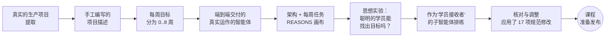

# 启动画布 — 财务帮助台智能体（8周课程）

> **格式。** 本画布以标题为导向，并使用 `---` 分隔，因此无需进一步编辑即可直接在 Marp / Reveal / Slidev 等幻灯片工具中渲染演示。您可以直接投影，或将每个 `## Slide N` 块复制到您选择的幻灯片工具中。管理者将看到完整的演示文稿；学员将看到相同的内容。幻灯片标题中的受众标签已被移除，以便整个演示文稿读起来像一个共享的故事。
>
> **配套文档。** `trainer/week_<NN>_handoff.md` 下的每周培训师画布包含进行中的讨论要点；`.cursor/skills/trainer-pr-review/SKILL.md` 下的 PR 审查技能包含评分标准；`rehearsal/SUMMARY.md` 中的排练总结包含课程验证摘要。

---

## 幻灯片 1 — 这个项目到底是什么

**一句话总结：** *这是一个我们端到端构建、深度解剖，并将其重新包装为八周课程的生产级别 GenAI 智能体。* 它同时是两个“游乐场”：

| 游乐场 | 你构建什么 | 你内化什么 |
|---|---|---|
| **智能体开发** | 一个财务帮助台智能体：基于 CFPB 投诉和银行政策文档的 RAG、LangGraph 编排、Pydantic 结构化输出、LLM-as-judge 评估、安全护栏、反馈飞轮、具有成本意识的上下文工程。 | 完整的 GenAI 生命周期：摄取 → 检索 → 编排 → 提示词 → 评估 → 数据质量 → 安全性 → 扩展。 |
| **SPDD 规范** | 每个每周任务都以 **REASONS 画布**的形式发布。学员在周一填写，周三进行评审，周五提交代码，周日与培训师的目标画布进行核对调整。 | Thoughtworks 正式提出的（2026-04）结构化提示词驱动开发（Structured Prompt-Driven Development）。说明书不再仅仅是文档；它是 AI 每次生成代码时接收的编译器输入。 |

**为什么这对业务至关重要。** 冻结的 LLM（大型语言模型）市场正在快速商品化。竞争优势不再是“你有 GPT-4 吗？” — 而是 *“你能在你自己的数据、护栏和评估机制下正确地编排它吗？”* 这种编排能力正是本课程所要培训的实践。

**成本控制的抓手。** 我们在第 4 周和第 8 周指导的其中两项技术（对话历史压缩和意图驱动的提示词缓存分组）直接降低了 LLM 的 token 开销。在 Anthropic 的 `prompt_caching` 定价模型下，一个良好分组的静态前缀可以在命中缓存的调用中降低 **约 80%** 的成本。我们不仅仅在教授漂亮的模式；我们还在教授将 GenAI 功能推向原型阶段之外并实现可交付的成本控制规范。

**其他课程所没有的东西。** 我们构建的智能体就是*参考答案*。学员朝着这个目标构建，每周进行评审，但在每个周日揭晓前他们是看不到答案的。大多数课程都会给你答案并让你重现它。而我们将答案交给了智能体本身，然后重新推导出了问题。正是这种信息不对称，使得“设陷与揭晓（trap-and-reveal）”的教学法成为可能（见幻灯片 5）。

---

## 幻灯片 2 — 我们如何设计这门课程

这不是一门从零开始编写的课程。它是从一个真实运作的项目中**提取**出来的，并转化为适合学员接受的形态。下面箭头上的每一步都是存在于此代码库中的可交付成果。



步骤详解：

1. **从真实项目中提取。** 智能体拓扑结构、数据形态、评估标准、安全策略——这些都不是为课程凭空发明的。它是从一个今天仍在生产环境中运行的已交付 GenAI 帮助台中逆向工程出来的。这就是为什么宪章规范感觉像是承重墙：因为它们*首先*承受了真实的生产负载，然后才被用于教学。
2. **编写项目描述。** 这是一份单一文档，抓住了*交付物是什么*、*用户可见的行为是什么*、*运营形态是什么*以及*业务需求是什么*。这份文档现在成为了 `.spdd_specs/0_Root_Architecture.md` 中的项目宪章。
3. **拆分为每周目标。** 八周，八个架构节奏。每个节奏都足够小，初级人员可以在一周内完成；又足够大，至少能暴露一个真实的工程权衡。
4. **实现真实运作的智能体。** 代码位于 `app/`、`data_pipelines/`、`tests/`、`ui/`。它可以运行。它能通过自身的评估。它会拒绝违禁话题。它使用 pgvector 处理了 1000 条 CFPB 投诉。评估扫描在夜间运行；第 6 周中 v0/v1 的对比数据是真实的。
5. **转换为架构 + 每周任务。** 从工作代码中提取了宪章和八个任务画布。每个任务都是一个 REASONS 画布：需求 (Requirements)、实体 (Entities)、方法 (Approach)、结构 (Structure)、操作 (Operations)、规范 (Norms)、护栏 (Safeguards)。每个任务发布两个版本：一个是 `*.trainee.md`（说明不充分，留有 `TODO(trainee)` 空白），另一个是 `*.md`（目标状态，周日揭晓）。
6. **思想实验：聪明的学员能搞清楚吗？** 在发布之前，我们阅读了每个 `.trainee.md` 并扪心自问：*如果只给出这份未充分说明的画布，一个聪明的学员能找到正确的架构方向吗？* 如果答案是“不能”，我们就重写画布，直到留下的线索足够清晰。这是第一遍验证过程。
7. **作为学员接收者的子智能体排练。** 我们使用一个上下文干净的 AI 子智能体，每周在学员材料上运行一次。该子智能体充当自学者；父智能体充当培训师助手。完整的协议位于 `.cursor/skills/subagent-trainee-rehearsal/SKILL.md`。这是第二遍验证过程——这一遍能发现粗心的人类审阅者遗漏的漏洞，因为子智能体没有课程上下文来填补规范的空白。
8. **核对与调整。** 排练在八周内暴露出 **16 个实质性漏洞**；我们将 **17 项规范修改**合并回了面向学员的材料中。完整的摘要位于 `rehearsal/SUMMARY.md`。模式是一致的：概念脚手架是合理的，但需要收紧精确的锚点（图拓扑结构、魔术字符串、模式类型）。这种收紧正是区分“感觉完整”的课程和“真正完整”的课程的分水岭。

结果：这门课程中，学员的体验与真实工程师在生产级别 GenAI 团队前八周的体验如出一辙——周一简报、周三评审、周五写代码、周日核对调整——而目标状态始终比他们的工作进度晚一周揭晓。

---

## 幻灯片 3 — 该项目在行业全景图中的位置

**一句话总结：** *我们不是在训练模型。我们是在为冻结的、预训练的推理引擎构建外围神经系统。*

|  | 它是什么 | 我们采用的工具 | 我们忽略的工具 |
| --- | --- | --- | --- |
| **机器学习 (ML) 开发** | 训练权重、调整损失、选择架构。 | PyTorch, JAX, 梯度下降。 | — |
| **机器学习运维 (MLOps)** | 将这些权重部署并监控为服务。 | SageMaker, MLflow, 模型注册表。 | — |
| **人工智能运维 (AIOps)** | 使用 AI 监控 IT 基础设施（预测停机时间）。 | Datadog Watchdog, Splunk ITSI。 | — |
| **生成式 AI (GenAI) 开发（我们在这里）** | 用严格的上下文、工具和护栏编排冻结的 LLM。 | LangGraph, pgvector, Pydantic, evals, 提示词注册表。 | LangChain agents（我们需要显式图）；专有向量数据库（我们使用 pgvector）；SaaS 提示词注册表（我们的提示词存在 git 中）。 |

本课程准确定位于 **GenAI 开发**。它不是 ML 课程。它不训练权重。它教授的是将冻结的 LLM 转化为可靠产品组件的规范纪律。

---

## 幻灯片 4 — 传统需求说明书的消亡

**旧世界。** 初级工程师拿到一份软件设计说明书，读了一遍，写了代码，然后就再也没碰过那个文档。六周后，该文档就充满了谎言——而且没人知道谎言指向哪个方向。

**新世界。** 我们使用**结构化提示词驱动开发 (SPDD)** — 这是 Thoughtworks 在 2026-04 的文章中正式确立的方法论。说明书不再是 Wiki 页面。它是 AI 每次生成代码时接收的*确切指令集*。

**说明书的格式**是 **REASONS 画布**：需求 (Requirements)、实体 (Entities)、方法 (Approach)、结构 (Structure)、操作 (Operations)、规范 (Norms)、护栏 (Safeguards)。本课程中的每一个每周任务都以 REASONS 画布发布。项目的宪章也是如此。

为什么这行得通：说明书的*功能*变了。它曾经是文档；现在它变成了编译器输入。发生偏移的说明书会直接导致构建失败（AI 会生成错误的东西）。这使得偏移能够立即被发现，而不是等到六周之后。

**我们与经典 SPDD 的差异。** 经典的 SPDD 将文件命名为 `{JIRA}-{TIMESTAMP}-{ACTION}-{scope}.md`。我们使用 `Task_<N>_<Topic>.md`，因为课程有稳定的每周编号，并且学员会收藏这些文件。这一点记录在项目宪章的 *SPDD 规范* 标准中。

### SPDD 在软件工程演进中的位置

SPDD 不是 Agile 或 DevOps 的替代品；它是当"编译器"变成 LLM、瓶颈从人类打字速度转移到机器不确定性之后，*下一代*的方法论。下表使用树的隐喻——根、枝、叶——展示我们正在离开的一代（SE 2.0，*数据增强与迭代式*）和我们正在进入的一代（SE 3.0，*AI 原生与智能体化*）。SPDD 是 SE 3.0 多个叶子级实践之一，与其它兄弟实践共享同一个意图驱动 (Intent-Driven) 与规范驱动 (Spec-Driven) 的方法论根基。

| 层级（树的隐喻） | SE 2.0 — *数据增强与迭代式* | SE 3.0 — *AI 原生与智能体化* |
|---|---|---|
| **要解决的问题** | 管理人类的不可预测性、打字速度、以及跨团队沟通约束。 | 管理机器的不确定性、编排认知负载、保证意图到代码的翻译保真度。 |
| **1. 根**（核心方法论） | **Agile 与 DevOps** — 拥抱变化优于遵循计划；将开发与运维统一。 | **IDD 与 SDD** — 定义人类期望的结果（Intent-Driven，意图驱动），并将其锁定为机器可读的契约（Spec-Driven，规范驱动）。 |
| **2. 枝**（运营支柱 / 框架） | **Scrum、Lean Kanban、SAFe、LeSS、SoS** — 结构化系统，用于协同人类小组并扩展他们的协作效率。 | **Spec=Code、EDD、Abstraction First** — 治理法则：规范是唯一可信来源；以 LLM-as-a-Judge 作为门控（EDD）；并在生成代码之前锁定边界。 |
| **3. 叶**（日常实践 / 实践群） | **TDD、DDD、CI/CD、结对编程、XP** — 颗粒度细致、以人为中心的工程习惯，保障代码质量与安全性。 | **SPDD、BMAD、OpenSpec、SpecKit、Superpowers、MUSUBI、GSD** — 团队用以执行意图并核对调整规范的相互竞争的框架与日常习惯。 |

> **关于 SE 3.0 *叶* 这一行的成熟度提示。** 与 SE 2.0 的枝（**Scrum、Kanban、SAFe、LeSS、SoS**）经过十年以上的生产环境淘汰才被社区与行业共同推举为权威答案不同，上面 SE 3.0 这一行的叶子级实践都还很年轻（撰写本文时大多不到两年）。它们之中尚没有任何一个像 Scrum 在 2010 年代之于 SE 2.0 那样赢得"这就是权威答案"的位置。判决终会到来——可能从上述名单中产生，也可能由今天还没出现的新玩家胜出。我们尚未到达那一刻。请将此行读作*"本课程承认的候选者"*，而不是*"行业已经加冕的赢家"*。

给在场管理者的三个要点：

1. **方法论的转换不是工具升级。** SE 2.0 讲的是人与人协同的故事；SE 3.0 讲的是人与机器协同的故事——而这台机器能大规模生成代码，却无法被信任与意图保持一致。治理的单元从"团队"转移到了"规范"。
2. **SPDD 只是一片叶子，不是唯一一片——而且这一行尚未被加冕。** BMAD、OpenSpec、SpecKit、Superpowers、MUSUBI、GSD 都是它的兄弟；各自对如何编码意图、如何门控 AI 输出有不同的看法，而行业尚未跑完那个产生了 SE 2.0 之"Scrum"的多年淘汰循环。我们选择 SPDD 是因为 REASONS 画布 + 周日核对调整循环最适合一个每周都重复使用同一形态的 8 周课程——*同时* 因为即使最终的判决落在某个兄弟身上，本课程培养的纪律也能迁移。我们用这门课程购买的是 **规范纪律**，不是文件格式；文件格式是最便宜可被替换的部分。
3. **Agile、TDD、CI/CD 不会消失。** 它们继续维持团队中"人的一面"运转。SE 3.0 是叠加在 SE 2.0 *之上*，而不是取代它。

---

## 幻灯片 5 — 课程弧线：从模糊到清晰

学员将构建一个财务帮助台智能体。在第 1 天，这个应用只是一个模糊的想法。随着时间的推移，我们逐周对焦。

```text
第 0 周 ┆ 环境     → Docker Compose，仅 healthz 健康检查。
第 1 周 ┆ 基础     → LLMService、Settings（设置）、结构化日志。
第 2 周 ┆ 朴素 RAG → 你会构建一个糟糕的 AI。它会产生幻觉。     （设陷阱，第 1 阶段）
第 3 周 ┆ 编排     → LangGraph 拓扑、AgentState、/agent/query。
第 4 周 ┆ 提示词   → 版本化模板 + 第一阶段对话压缩。
第 5 周 ┆ 评估     → 我们精确测量智能体到底有多糟糕。             （陷阱触发）
第 6 周 ┆ 数据质量 → 我们修复数据，而不是提示词。                 （杠杆点）
第 7 周 ┆ 安全+CI  → 锁定系统。生产环境的反馈循环流回评估中。
第 8 周 ┆ 扩展     → 可选菜单：分支、功能标志、脏数据处理、
                     成熟的上下文工程（回到 SPDD 的元循环）。

```

关键在于**设陷与揭晓**。大多数课程给出有效的答案并让你重现。我们给出一个*有缺陷的*答案，让 LLM-as-judge 无情地暴露其局限性。这是培养“*提示词无法修复垃圾数据*”这种资深工程师直觉的唯一途径。

---

## 幻灯片 6 — 每周节奏

每一周看起来都一样。把它刻进肌肉记忆中。

```text
   周一              周三                 周五                 周日
    │                 │                    │                    │
    ▼                 ▼                    ▼                    ▼
  接收任务          规范门控             代码 PR               揭晓答案
 Task_<N>.        (在使用AI生成       (最终代码 + 已核对    (培训师发布目标状态
 trainee.md       任何代码前进行        修改的 .trainee.md)    即 Task_<N>.md)
                  架构评审)

```

| 星期 | 交付物 | 门控 |
| --- | --- | --- |
| **周一** | 学员接收 `Task_<N>_<Topic>.trainee.md`。它是故意**不完整**的。 | 无 — 开始工作。 |
| **周三** | 学员提交填写好的 `.trainee.md`（注意到的风险、接受的权衡、类图、操作分解）给培训师签字确认。 | **强烈建议在培训师确认架构思路之前，不要使用 AI 生成代码。** 这是本课程最强有力的指导原则；也是锻造资深直觉的地方。 |
| **周五** | 学员提交一个包含代码、测试和*已核对修改的* `.trainee.md` 的 PR。README 增加了一个新部分。冒烟测试仍能通过上周覆盖的检查。 | PR 审查技能（见 `.cursor/skills/trainer-pr-review/`）会标记任何规范偏移、丢弃的护栏或 LangChain 的幻觉。 |
| **周日** | 培训师发布规范的完整最终版本 — `Task_<N>_<Topic>.md`（没有 `.trainee` 后缀）。学员将他们的工作与此进行差异对比，在同一个星期的分支中提交一个*核对调整 PR*，合并它，然后周一开启第 N+1 周。 | 周日的揭晓是目标画布允许进入学员代码库的*唯一*时刻。在周三之前阅读它会使课程的整个教学循环短路。 |

---

## 幻灯片 7 — 八周末你将掌握的两项技能

我们特意将两项技能叠加在一起：

1. **智能体开发** — LangGraph、RAG、评估、安全性、反馈飞轮。这是有形的交付物。
2. **作为一门学科的上下文工程** — REASONS 画布、SPDD 规范、意图提取、提示词缓存分组、对话记忆压缩。这是无形的交付物。

第二项技能的精妙之处只有在课程结束时才会显现。到了第 8 周你会意识到：**SPDD 就是应用于你自身的上下文工程**。你花了八周时间为 AI 梳理意图；AI 是你的学徒；画布是缓存；核对调整步骤是评估。你构建的*智能体*是胜利的绕场一周；你建立的*工作流*才是你经理在你的余下职业生涯中真正付钱让你做的事情。

这种闭环在第 8 周的**上下文工程子任务**中得到了明确的传达。这是可选的。完成它的学员将作为上下文工程师（Context Engineers）从培训中毕业。跳过它的学员将作为合格的智能体开发者毕业 — 同样是有价值的结果，但层次不同。

---

## 幻灯片 8 — 我们如何评分

每周考察三个维度。培训师使用评分技能来进行审查 — 原文提示词请见 `.cursor/skills/trainer-pr-review/SKILL.md`。

1. **SPDD 核对调整。** `.md` 文档和代码保持同步了吗？规范偏移是典型的 Bug 模式；发现偏移是典型的审查动作。
2. **AI 操作与惰性。** 学员是否盲目接受了 AI 产生的 600 行幻觉？未使用的引入 (imports)、在指定使用 LangGraph 的地方过度工程化地使用了 LangChain 抽象、丢弃了护栏 — 所有这些都会被标记。
3. **架构思维。** 学员在他们的*接受的权衡*部分中未能预见到哪些二阶和三阶后果？这是培训师首先阅读的部分。

一个测试全部通过的干净 PR，如果其“权衡”部分很单薄，那会被标记为红灯。一个略显杂乱的 PR，如果有一份经过深思熟虑的“权衡”部分，会被标记为黄灯。我们给思维过程打分，而不是打字过程。

---

## 幻灯片 9 — 排练已经暴露出的失败模式

排练中发现的模式 — 其中一些我们已经在规范中预先修复，还有一些仍属于导师指导的范畴。**在学员看到材料之前，我们已经发现了 16 个实质性漏洞，并合并了 17 次规范更新。** 预先修复的列表位于 `rehearsal/SUMMARY.md`。剩下的是需要人类介入指导的层面：

| 模式 | 具体表现 | 应该怎么做 |
| --- | --- | --- |
| **用规范进行“粘贴轰炸”** | "这是 8 页的 Task 画布。去构建吧。" | 阅读 `.spdd_specs/AI_OPERATIONS.md`。使用 Plan（计划）模式。每次执行一两步操作，每步完成后提交 (commit)。 |
| **产生幻觉的技术栈** | AI 导入了 `langchain.agents.AgentExecutor` 或建议使用 Pinecone。 | 重新将宪章作为上下文附加进去。重启请求。宪章中明确指定了 LangGraph 和 pgvector。 |
| **懒惰的核对调整** | "AI，更新说明书以匹配我的代码。" | 对于 `Safeguards`（护栏）和 `Norms`（规范）来说这是被禁止的。AI 可以作为聊天建议*起草*更新；学员必须手动阅读每一行。培训师会抓住那些被默默丢弃的护栏。 |
| **跳过周三的门控** | "我先随便写点代码凑合一下；画布只是走个过场。" | 设立这个门控正是*因为* AI 会放大误解。周三的规范签字确认是纠正错误方向成本最低的地方。 |
| **将评估失败视为针对个人** | "评委说我第 2 周的工作只有 30% 的任务成功率。这课程太不公平了。" | 评委（的低分）本身就是我们要教的课。第 2 周的 RAG *本来就注定*在第 5 周的测量中失败。这节课是*提示词无法修复垃圾数据* —— 它是通过体验失败来传授的，而不是通过被告知。 |
| **把任务 8 当成家庭作业** | "可选的意思就是我可以跳过它。" | 可选的子任务正是资深直觉发挥作用的地方。特别是子任务 D（上下文工程），它是整个课程在情感上的高潮点。 |

**排练总结。** 每周的概念脚手架都经受住了考验。需要收紧的是：图拓扑锚点（新节点相对于现有节点的位置）、魔术字符串锚点（例如，字面上的 `[summary of earlier turns] ` 前缀）、模式类型锚点（`text[]` 对比 `jsonb`），以及护栏中语气偏移的清理。第 1 周学员看到的课程，已经是包含了所有 17 项修改的版本。

---

## 幻灯片 10 — 本课程的未来走向

这次启动会是生命周期中**向前推进并回顾**的一半。**持续向前推进**的另一半 — 在学员学习完课程之后发生的事情 — 才是 SPDD 投资发挥复利效应的地方。

```mermaid
flowchart LR
  subgraph BUILD ["第一阶段：构建（此代码库）"]
    direction TB
    P1[真实的生产项目] --> P2[项目描述]
    P2 --> P3[每周目标]
    P3 --> P4[真实运作的智能体]
    P4 --> P5[REASONS 画布]
    P5 --> P6[思想实验]
    P6 --> P7[子智能体排练]
    P7 --> P8[合并规范的修改]
  end

  subgraph TEACH ["第二阶段：辅导一个班次"]
    direction TB
    C1[学员开展<br/>8 周课程] --> C2[真实的学员<br/>体验 SPDD]
    C2 --> C3[周五的 PR +<br/>周日的核对调整]
    C3 --> C4[向着培训师的<br/>目标画布进行<br/>最终核对调整]
  end

  subgraph SPREAD ["第三阶段：推广 SPDD"]
    direction TB
    S1[学员作为上下文<br/>工程师毕业] --> S2[每个人将 SPDD<br/>带入自己的团队]
    S2 --> S3[SPDD 成为更多项目<br/>默认的规范格式]
    S3 --> S4[团队级 SPDD 指南 +<br/>共享的 REASONS 画布库]
  end

  subgraph FLYWHEEL ["第四阶段：大团队体验飞轮"]
    direction TB
    F1[跨团队的 SPDD<br/>复盘回顾] --> F2[课程的修订<br/>在这里落地]
    F2 --> F3[下一批学员从更<br/>清晰的基线开始]
  end

  P8 --> C1
  C4 --> S1
  S4 --> F1
  F3 -.-> P8

  style P8 fill:#cfe,stroke:#393
  style C4 fill:#cfe,stroke:#393
  style S4 fill:#cfe,stroke:#393
  style F3 fill:#cfe,stroke:#393

```



用文字解释该图：

* **第一阶段 (构建/BUILD)** 是这个代码库中已有的内容。八个步骤，和幻灯片 2 上的八个步骤相同。输出是可以供学员学习的课程。
* **第二阶段 (教学/TEACH)** 是学员学习课程的实际过程。学员每周体验 SPDD 循环。周日的核对调整步骤是每位学员的工作与培训师目标画布的交汇点；学员提交一个小的核对调整 PR；他们第 N 周的产物收敛到目标形态，而他们如何到达那里的*推理过程*作为提交 (commit) 历史被保留下来。
* **第三阶段 (推广/SPREAD)** 是第 8 周之后发生的事情。每位毕业的上下文工程师将使用 REASONS 画布的习惯带入他们的下一个团队。SPDD 成为组织内更多项目的默认规范格式。REASONS 画布库开始在团队或组织层面积累。
* **第四阶段 (飞轮/FLYWHEEL)** 是制度化的学习循环。跨团队的 SPDD 回顾会暴露摩擦模式；这些模式作为课程修订反馈回这个代码库；下一批学员就能从更清晰的基准开始。从 F3 到 P8 的虚线箭头是长期的投资论点：每一批学员都在打磨用于培养下一批学员的课程。

复利效应才是关键。第一批学员的成本最高（构建此代码库）。只要反馈循环在运作，后续每一批学员的成本都会降低，并且能产出更敏锐的成果。管理者的工作是保持不同批次学员之间的这个反馈循环充满活力。

---

## 幻灯片 11 — 给管理者：一个要求与一个建议

一个硬性要求，一个建议。

1. **培训师的 SLA（要求）。** 周末的核对调整审查必须在 24 小时内完成。如果培训师花了 4 天时间，学员就会在没有反馈的情况下进行第 N+1 周的工作，并养成坏习惯。如果培训师不能承诺这个 SLA，那么整个班次的进度都需要推迟。
2. **算力路径（建议，不是要求）。** 算力*不需要*管理者集中预算。Cursor 已不再适用于本课程。以下是按性价比排序的若干路径，排序并不否定学员已有的选择。这之所以是*建议*而不是要求，是因为**项目中没有任何客户数据流转**：语料是公开的 CFPB 投诉数据集，学员产出的所有制品都是教学性质的。因此个人 API token 在这里是安全的。

   * **1 — 公司 Copilot（默认推荐）。** 申请 GitHub Copilot 或类似的公司编码计划。无需个人付费，融入现有工作流。
   * **2 — Opencode Go($5 1st Month, $10 following)。** 低成本订阅。支持模型：DeepSeek V4、Mimo v2.5、Minimax 3。首月 $5，之后每月 $10。
   * **3 — Opencode Zen(Do not enable Billing)。** 免费，无需设置计费。内置模型提供良好的课程开发性能，零成本。
   * **4 — DeepSeek 官方充值。** 直接充值 DeepSeek 账户使用 API，按量计费，无订阅约束。
   * **5 — 本地 Ollama / mlx-community-optiq。** 拉取模型后完全免费离线运行，但在消费级硬件上明显较慢。如果 16GB 的 Mac 上 `gemma3:27b` 内存交换严重，学员可以在 `.env` 里把 `OLLAMA_CHAT_MODEL` 切换为 `qwen3.5:4b`。课程依然能落地。
   * **6 — 学员已有的编码计划订阅。** 如果学员已经订阅了 Cline、Continue、Windsurf 或其他编码计划，也可以继续使用。本课程不强制指定提供商。

   净结果：学员根据自己的机器和习惯自行选择路径。管理者的职责只是清空通道——而不是把它中央化。

**排练后的一个额外建议：** 在第一批学员运行完毕后，为*第二次*排练预留预算。排练协议（见 `.cursor/skills/subagent-trainee-rehearsal/SKILL.md`）是可以重复使用的。利用下一批学员的修订内容在中途再运行一次，可以在偏移传导给学员之前捕捉到它，代价只是每周占用几小时的时间。这就是幻灯片 10 中的飞轮保持润滑的方式。

---

## 启动会的结束语

> *八周后，学员们不仅仅是构建了一个智能体。他们将内化把 AI 从魔术变成工程的规范。智能体只是人工制品；这种规范才是真正的交付物。并且规范是可扩展的：这门课程培养出的每一位上下文工程师，都是下一个项目、下一个团队、下一批学员采用 SPDD 的种子。*
